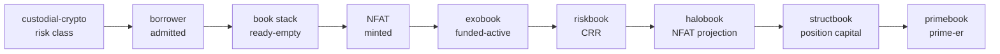
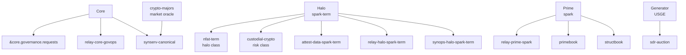
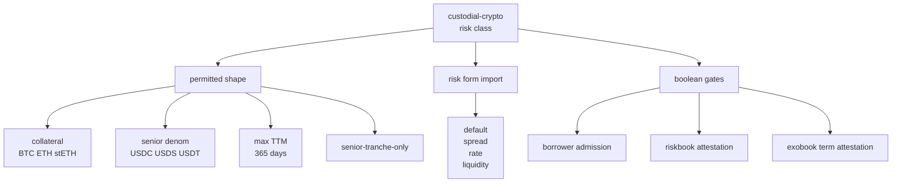
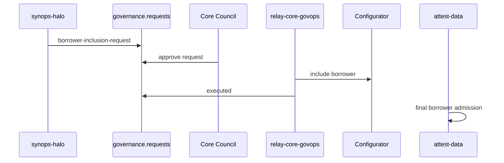
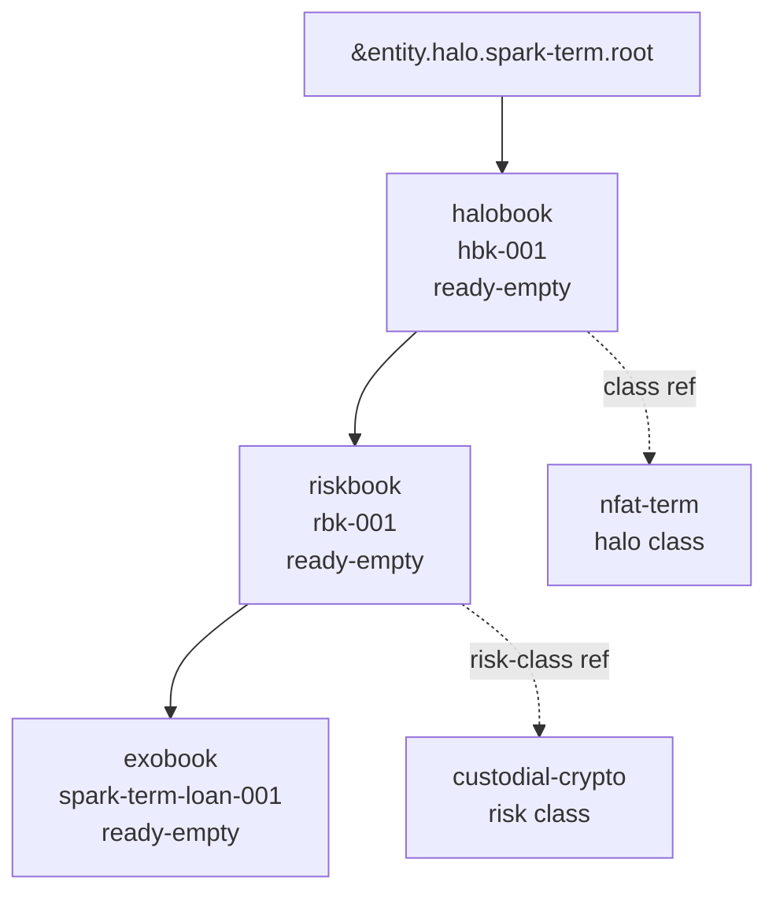
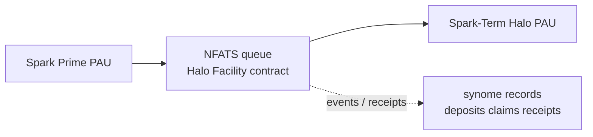
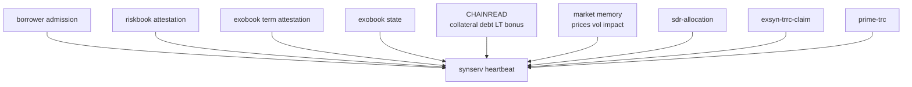
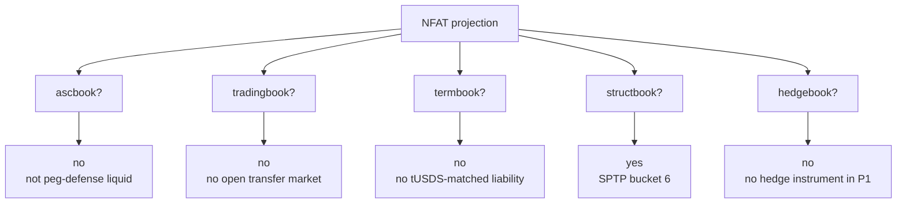
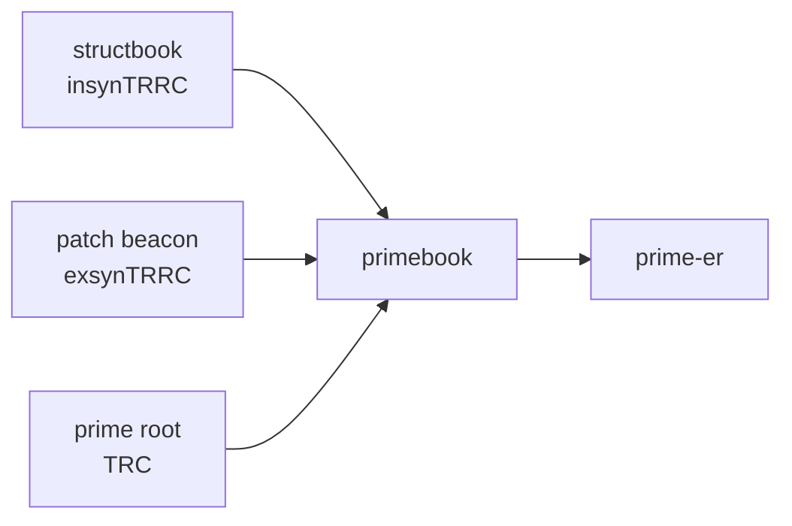
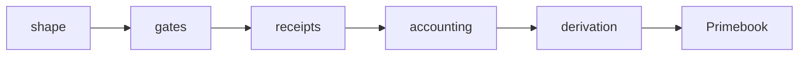

# Scenario 1: Borrower to Primebook

Risk class setup, NFAT origination, and Spark Prime ER.

Designed for screensharing.


---


## Source Thread

This deck condenses the roadmap scenario:

```text
lani/experimental/roadmap/p1-borrower-nfat-user-scenario.md
lani/experimental/roadmap/p1-nfat-atom-trace.md
lani/experimental/roadmap/phase-1-spaces.md
```


---


## What It Shows

```text
risk class
borrower admission
ready-empty books
NFAT mint
funded exposure
risk rollup
Primebook output
```





---


## Fixed Scenario

| Item | Value |
|---|---|
| Halo | `spark-term` |
| Prime | `spark` |
| Risk class | `custodial-crypto` |
| Halo class | `nfat-term` |
| Borrower | `borrower-001` |
| Halobook | `hbk-001` |
| Riskbook | `rbk-001` |
| Exobook | `spark-term-loan-001` |
| NFAT unit | `nfat-spark-term-001` |
| Loan | 180-day USDC senior loan |
| Senior notional | `750000` USDC |
| Collateral | BTC in a pre-recorded collateral account |


---


## Cast




---


## Before The User Flow

Phase 1 genesis writes the substrate.

```text
Guardian sudo writes:

core spaces
beacon registry
halo classes
risk classes
relay loops
synops loops
attestor loops
prime patch beacons
synserv heartbeat
```


---


## The Local Risk Class

In P1 the risk class is local to the Halo.

```metta
;; in &entity.halo.spark-term.nfat-term
(permitted-risk-classes nfat-term [custodial-crypto])
(max-ttm-days nfat-term 365)
(unit-standard nfat-term nfat-term)

;; in &entity.halo.spark-term.custodial-crypto
(risk-class custodial-crypto)
(risk-form custodial-crypto risk-form-hash-001)
(attestation-gates custodial-crypto
   [borrower-admission riskbook exobook-term])
```


Later phases can change where the risk form comes from.

The consumption site stays fixed.


---


## Risk Class Shape




---


## 1. Borrower Setup

Halo govops prepares a borrower before any capital is queued.

```metta
;; in &entity.halo.spark-term.custodial-crypto
(proposed-borrower-setup borrower-001
   (proposed-by synops-halo-spark-term)
   (disbursement-account ethereum disbursement-account-001)
   (collateral-account ethereum collateral-account-001)
   (custodian custodian-001)
   (legal-framework-ref legal-framework-001)
   (scope-ref borrower-setup-hash-001))
```


This is setup.

Not admission yet.


---


## 2. Readiness Gate

The attestor signs a boolean readiness gate.

```metta
;; in &entity.halo.spark-term.custodial-crypto
(borrower-readiness-attestation borrower-001
   (attestor attest-data-spark-term)
   (readiness pass)
   (claims
      (legal-framework-enforceable true)
      (account-binding-valid true)
      (custody-setup-current true)
      (borrower-credit-standing normal))
   (scope-ref borrower-setup-hash-001)
   (sig "..."))
```


This lets Halo govops ask Core Council for inclusion.


---


## 3. Core Inclusion




Core inclusion is external authority.

The synome records it.


---


## 4. Final Borrower Admission

After Configurator inclusion is real:

```metta
;; in &entity.halo.spark-term.custodial-crypto
(custodial-borrower-admission borrower-001
   (attestor attest-data-spark-term)
   (status ok)
   (disbursement-account ethereum disbursement-account-001)
   (collateral-account ethereum collateral-account-001)
   (claims
      (configurator-whitelist-current true)
      (legal-framework-enforceable true)
      (account-binding-valid true)
      (custody-setup-current true)
      (borrower-credit-standing normal))
   (scope-ref borrower-setup-hash-001)
   (sig "..."))
```


This is the borrower-level rollup gate.


---


## 5. Ready-Empty Books

The borrower is admitted.

No Prime has funded the deal yet.




`ready-empty` means action-ready structure.

It is not funded exposure.


---


## 6. Halobook

```metta
;; in &entity.halo.spark-term.halobook.hbk-001
(book-kind hbk-001 halobook)
(halo-class-ref hbk-001 &entity.halo.spark-term.nfat-term)
(lifecycle hbk-001 ready-empty T6)
(child-riskbook hbk-001 rbk-001
   &entity.halo.spark-term.riskbook.rbk-001)
```


The halobook is the Halo-side book boundary.

It will later carry the NFAT liability.


---


## 7. Riskbook

```metta
;; in &entity.halo.spark-term.riskbook.rbk-001
(book-kind rbk-001 riskbook)
(parent-halobook rbk-001
   &entity.halo.spark-term.halobook.hbk-001)
(risk-class-ref rbk-001
   &entity.halo.spark-term.custodial-crypto)
(risk-form-import rbk-001 custodial-crypto risk-form-hash-001)
(lifecycle rbk-001 ready-empty T6)
```


The riskbook imports the current local risk form.

Later propagation changes provenance, not the read path.


---


## 8. Exobook

```metta
;; in &entity.halo.spark-term.exobook.spark-term-loan-001
(book-kind spark-term-loan-001 exobook)
(parent-riskbook spark-term-loan-001
   &entity.halo.spark-term.riskbook.rbk-001)
(borrower spark-term-loan-001 borrower-001)
(frame spark-term-loan-001 usd)
(collateral-ref spark-term-loan-001
   (asset btc)
   (chain ethereum)
   (account collateral-account-001))
(senior-tranche spark-term-loan-001 senior-001
   (denom usdc)
   (notional 750000))
(term-intent spark-term-loan-001
   (maturity-T maturity-T-001)
   (ttm-days-intended 180))
(lifecycle spark-term-loan-001 ready-empty T6)
```


The loan object exists.

The loan is not disbursed.


---


## 9. Spark Prime Queues USDS

Spark Prime agrees to fund the ready halobook.

```metta
;; in &entity.prime.spark.relay
(nfat-queue-deposit spark-term hbk-001
   (prime spark)
   (asset usds)
   (amount 750000)
   (chain ethereum)
   (tx prime-queue-deposit-tx-001)
   (timestamp T7))

;; in &entity.prime.spark.root
(prime-nfat-deploy-intent spark nfat-spark-term-001
   (halo spark-term)
   (halobook hbk-001)
   (notional usd 750000)
   (timestamp T7))
```


Prime-side intent is recorded.

The queue itself is chain-side contract state.


---


## Queue Boundary




No queue Space is added.

The synome sees receipts.


---


## 10. Halo Claims And Mints

```metta
;; in &entity.halo.spark-term.halobook.hbk-001
(queue-claim hbk-001 claim-001
   (from-prime spark)
   (asset-in usds)
   (amount-in 750000)
   (tx halo-queue-claim-tx-001)
   (timestamp T8))

(nfat-unit nfat-spark-term-001
   (source-riskbook rbk-001)
   (source-exobook spark-term-loan-001)
   (source-senior-tranche senior-001)
   (notional usd 750000)
   (maturity-T maturity-T-001)
   (halo-class nfat-term))

(nfat-holder nfat-spark-term-001
   (prime spark)
   (holder-pau spark-prime-pau)
   (timestamp T8))
```


The NFAT is the cross-book unit.

Halo liability.

Prime asset.


---


## 11. USDS To USDC

The Halo converts queued USDS into borrower-disbursable USDC.

```metta
;; in &entity.halo.spark-term.halobook.hbk-001
(halo-cash-conversion hbk-001 conversion-001
   (from usds 750000)
   (to usdc 750000)
   (chain ethereum)
   (tx halo-usds-usdc-conversion-tx-001)
   (timestamp T9))
```


This is relay-recorded chain action.


---


## 12. Synops Assigns Book Assets

Now synops assigns accounting.

It moves no chain funds.

```metta
;; in &entity.halo.spark-term.halobook.hbk-001
(book-asset-assignment assign-001
   (assigned-by synops-halo-spark-term)
   (from-halobook hbk-001)
   (to-riskbook rbk-001)
   (to-exobook spark-term-loan-001)
   (asset usdc)
   (amount 750000)
   (source-receipt conversion-001)
   (timestamp T10))

;; in &entity.halo.spark-term.exobook.spark-term-loan-001
(assigned-principal spark-term-loan-001
   (asset usdc)
   (amount 750000)
   (assignment assign-001)
   (timestamp T10))
```


Invalid if the receipt or parent chain does not match.


---


## 13. Exobook Term Attestation

The attestor signs safe-to-disburse term readiness.

```metta
;; in &entity.halo.spark-term.exobook.spark-term-loan-001
(exobook-term-attestation spark-term-loan-001
   (attestor attest-data-spark-term)
   (underwriting pass)
   (claims
      (term-enforceable true)
      (maturity-T maturity-T-001)
      (ttm-days-at-funding 180)
      (cash-conversion-path-valid true)
      (disbursement-readiness true))
   (scope-ref exobook-term-config-hash-001)
   (sig "..."))
```


Still no prices.

Still no collateral amount.

Still no CRR number.


---


## 14. Funding Makes It Active

The Halo disburses USDC to the borrower.

```metta
;; in &entity.halo.spark-term.exobook.spark-term-loan-001
(funding-confirmation spark-term-loan-001
   (chain ethereum)
   (tx borrower-disbursement-tx-001)
   (block funding-block-001)
   (timestamp T_fund))

(lifecycle spark-term-loan-001 funded-active T_fund)
(term-start spark-term-loan-001 T_fund)
(ttm-days-official spark-term-loan-001 180)
```


Now the exobook is funded exposure.

Now it can enter the risk rollup.


---


## 15. Heartbeat Inputs




Inputs are atoms plus grounded reads.

Synserv derives outputs.


---


## 16. Rollup Gate

```metta
;; in &entity.halo.spark-term.riskbook.rbk-001
(rollup-gate rbk-001 spark-term-loan-001 H pass
   (borrower-admission ok)
   (riskbook-attestation pass)
   (exobook-term-attestation pass)
   (scope-match true)
   (fresh true))
```


Default rule:

```text
missing gate = no rollup
stale gate   = no rollup
scope drift  = no rollup
```


---


## 17. Risk Form Emits CRR

```metta
;; in &entity.halo.spark-term.riskbook.rbk-001
(custodial-crypto-crr-components spark-term-loan-001 H
   (default-crr 0.055)
   (spread-crr 0.018)
   (rate-crr 0.012)
   (liquidity-crr 0.030)
   (binding-scenario btc-liquidity-crash-v1))

(riskbook-crr-components rbk-001 H
   (default-crr 0.055)
   (spread-crr 0.018)
   (rate-crr 0.012)
   (liquidity-crr 0.030)
   (source-exobook spark-term-loan-001))
```


The attestor admits the structure.

The risk form computes the numbers.


---


## 18. Halobook Projects The NFAT

The halobook turns the riskbook output into a Prime-side NFAT projection.

```metta
;; in &entity.halo.spark-term.halobook.hbk-001
(nfat-prime-projection nfat-spark-term-001 spark H
   (source-exobook spark-term-loan-001)
   (notional-usd 750000)
   (sptp-bucket 6)
   (default-crr 0.055)
   (spread-crr 0.018)
   (rate-crr 0.012)
   (liquidity-crr 0.030)
   (permitted-unwind [maturity health-factor-breach])
   (transfer-market none))
```


This is the cross-book bridge.


---


## 19. Primebook Routing

The NFAT is evaluated against Primebook sub-books.




In P1, `structbook` is the active route.


---


## 20. Zero SDR Case

This scenario deliberately sets Spark's current bucket-6 SDR to zero.

```metta
;; in &entity.generator.usge.sdr-auction
(sdr-allocation spark 6 0 E)

;; in &entity.prime.spark.structbook
(structbook-match nfat-spark-term-001 H
   (required-bucket 6)
   (matched-notional 0)
   (unmatched-notional 750000)
   (allocation-source &entity.generator.usge.sdr-auction)
   (epoch E))
```


Zero SDR is not exclusion.

It means unmatched capital treatment.


---


## 21. Structbook Capital

```text
unmatched_crr = max(default-CRR, spread-CRR + liquidity-CRR) + rate-CRR

              = max(0.055, 0.018 + 0.030) + 0.012
              = 0.067

position_capital = 750000 * 0.067
                 = 50250
```


```metta
;; in &entity.prime.spark.structbook
(structbook-position-capital nfat-spark-term-001 H
   (matched-notional 0)
   (unmatched-notional 750000)
   (default-crr 0.055)
   (spread-crr 0.018)
   (liquidity-crr 0.030)
   (rate-crr 0.012)
   (unmatched-crr 0.067)
   (position-capital 50250))
```


---


## 22. Primebook Closes The Loop




The Primebook is where insyn and exsyn meet.


---


## 23. Primebook Atoms

Assume Spark already had:

```text
old insynTRRC = 300000
exsynTRRC     = 1200000
TRC           = 5000000
new position  = 50250
```


```metta
;; in &entity.prime.spark.structbook
(structbook-insyn-trrc spark 350250 H)

;; in &entity.prime.spark.primebook
(prime-insyn-trrc spark 350250 H)
(prime-trrc spark 1550250 H)
(prime-er spark 0.31005 H)
```


This is the P1 deliverable.


---


## ER Delta

```text
ER_before = (300000 + 1200000) / 5000000
          = 0.30000

ER_after  = (350250 + 1200000) / 5000000
          = 0.31005
```


The NFAT changes ER through:

```text
riskbook CRR
halobook projection
structbook unmatched capital
primebook TRRC / TRC
```


---


## Authority Boundaries

| Actor | What it can do |
|---|---|
| `attest-data` | sign boolean gates |
| `synops-halo` | write in-synome setup, requests, assignments |
| `relay-halo` | record external Halo actions and lifecycle |
| `relay-prime` | record Prime queue/deploy actions |
| `relay-core-govops` | record Core request and Configurator actions |
| `synserv` | derive risk, matching, TRRC, ER |
| `patch-prime` | write exsynTRRC scaffold |


---


## Common Confusions

```text
attestor is not a price oracle
attestor is not a CRR oracle
queue is not a synome Space
ready-empty is not funded exposure
synops does not move PAU funds
zero SDR is not default-deny
Primebook is where ER is emitted
```


---


## Default-Deny Branches

| Failure | Result |
|---|---|
| Missing borrower admission | exobook cannot roll up |
| Stale borrower admission | exobook cannot roll up |
| Missing riskbook attestation | riskbook excluded |
| Missing exobook term attestation | exobook excluded |
| Scope mismatch | same as missing |
| Exobook still `ready-empty` | tracked setup only |
| No SDR allocation | unmatched capital treatment |


---


## One Line

```text
risk class defines shape
attestor admits gates
relay records external action
synops assigns accounting
synserv derives risk and capital
Primebook emits ER
```



