# Sigil Show

Grounded atoms, sigils, workcells, and P1 boot.

Designed for screensharing.


---


## The Old Problem

`grounded atom` is too broad.

It hides three different things:

```text
values
evaluation control
executable powers
```


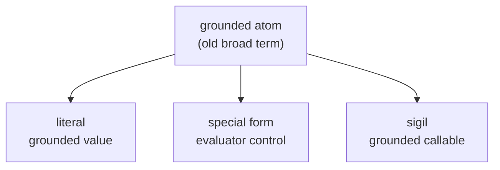


---


## The New Split

```text
literal
  value

special form
  evaluator control

sigil
  executable power
```


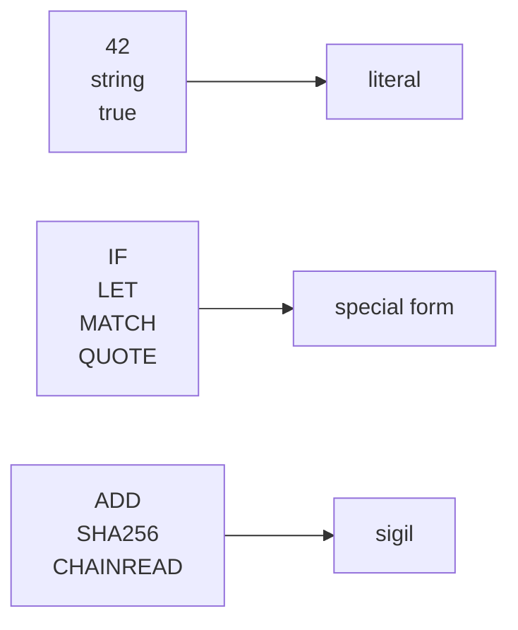


---


## Visual Rule

```text
lowercase = meaning
ALL CAPS  = power
$         = variable
&         = Space
numbers   = literals
```


```synlang
$borrower
&entity.halo.spark-term
loan-health
42
ADD
CHAINREAD
```


---


## Atom Classes

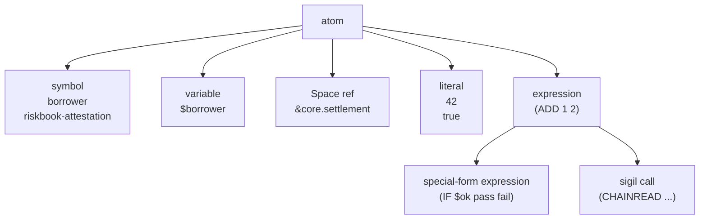


---


## Literal

Grounded value.

No special marker.


```synlang
42
3.14
"hello"
true
```


Built into Noemar parser and evaluator.

Small fixed set.


---


## Special Form

Evaluator-native control.

Arguments are **not** evaluated by normal call rules.


```synlang
(IF $healthy
    pass
    fail)
```


Only one branch evaluates.

That is why `IF` is not a normal function.


---


## Sigil

Grounded callable.

Arguments evaluate normally.

Then the sigil resolves through a binding.


```synlang
(ADD 1 2)
```


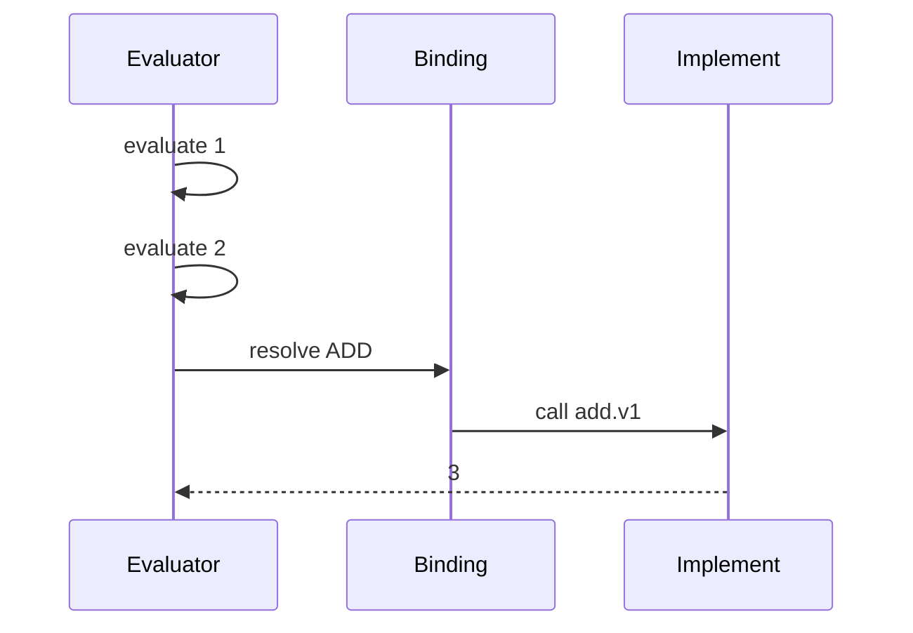


---


## Special Form vs Sigil

```text
special forms govern evaluation

sigils compute
```


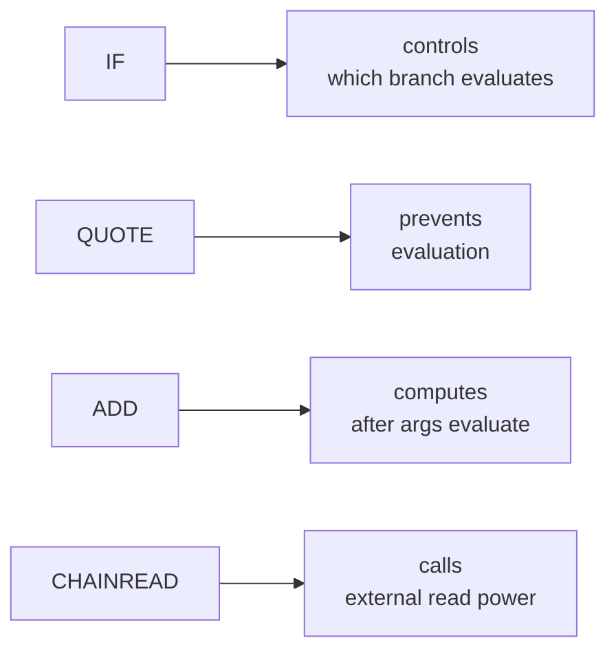


---


## Closed Core, Open Powers

```text
literals
  small fixed language substrate

special forms
  small fixed evaluator substrate

sigils
  open-ended governed capability layer
```


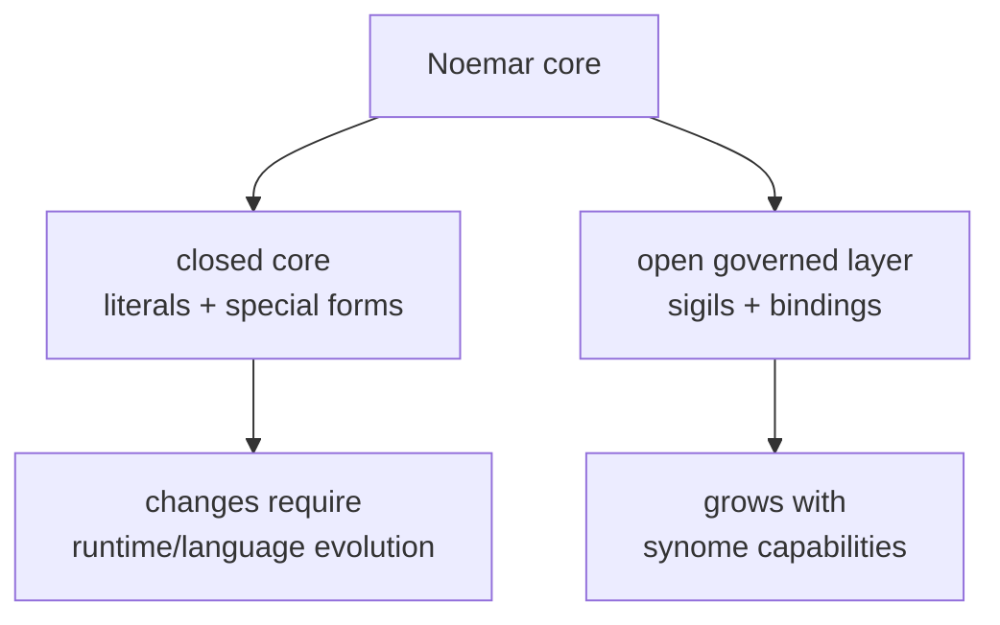


---


## Engineering Rule

```text
Adding a literal type changes the language.

Adding a special form changes the evaluator.

Adding a sigil changes the binding catalog.
```


That is the point of the split.


---


## Sigil Stack

```text
sigil
  synlang name for a power

binding
  governed wiring

implement
  controlled executable adapter

workcell
  externally situated operational setup
```


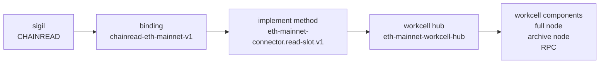

!(CHAINREAD 0x12837612847562746237wrerh)
(eth-tx from sfdisajfoiajsd to blabalabal sent 2000 eth)
($match eth-tx from spark-pau to spark-halo sent $_ eth) -> (2000)

CHAINREAD -> bind to -> C:user/path/to/chainread.py

---


## Sigil

The synlang-side callable symbol.


```synlang
(CHAINREAD ethereum
   collateral-account-001
   (balance btc)
   $block-ref)
```


The sigil is **not** the program.

The sigil is the name of the power.


---


## Binding

The governed mapping.


```text
sigil: CHAINREAD
binding-id: chainread-eth-mainnet-v1
implement: C:path/to/eth-mainnet-connector
method: read-slot
version: v1
mode: exo-implement
traits: [read-only, consensus-backed]
determinism: deterministic-at-block
verification: block-ref + proof policy
```


Binding answers:

```text
what code?
what method?
what types?
what authority?
what effects?
what proof / provenance?
```


---


## Implement

The controlled executable adapter.

Usually code.

Often Python in P1.


```text
eth-mainnet-connector.read-slot.v1
```


The implement method is what Noemar can actually call.

It should have a narrow typed interface.


---


## Implement Artifact

The source/package Noemar can materialize.


```text
implement-artifact:
  id: eth-mainnet-connector-v1
  language: python
  source-hash: sha256:...
  entrypoint: eth_mainnet_connector:read_slot
  tests: chainread-conformance-v1
  sandbox: no-network-except-workcell-hub
```


P1 can be simple:

```text
mega .synlang file contains implement source strings or artifact refs

bootstrap writes them to disk

bootstrap verifies hashes

binding points to local materialized paths
```


---


## Workcell

Bounded operational setup.

The real-world backing for implements.


In robotics, a workcell is not just a robot.

It is the whole local operating island:

```text
robot arm
controller
sensors
safety interlocks
fixtures
operator procedures
```


For Ethereum:

```text
full node
archive node
RPC endpoint
signer / HSM
monitoring
operator procedure
```


---


## Workcell Terms

```text
workcell
  bounded operational setup

workcell spec
  human-readable and testable requirements

workcell hub
  strict machine-facing service

workcell component
  concrete operator-provided piece
```


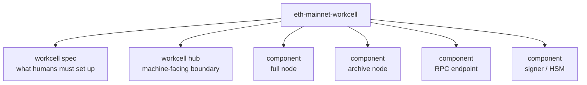


---


## Why Workcell Hub?

Implements should not talk to random infrastructure.

They call the hub.

The hub routes to components.


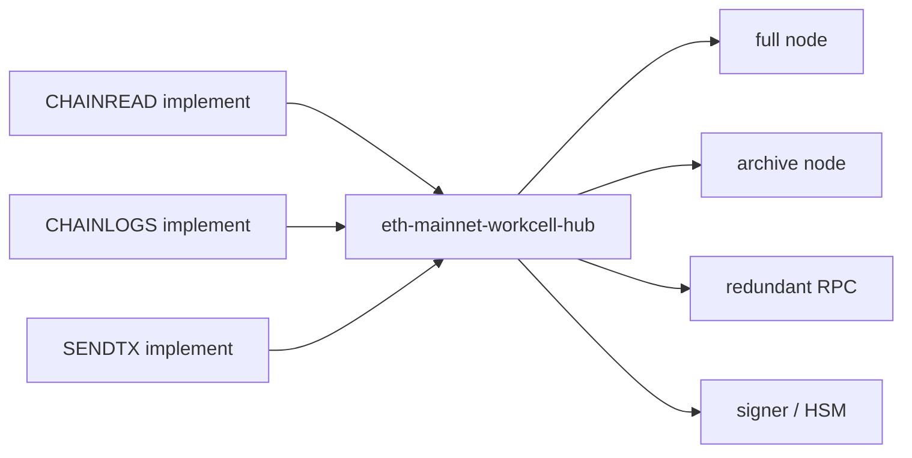


The hub normalizes:

```text
routing
health checks
failover
provenance
credentials
response shape
```


---


## P1 Workcell Boundary

P1 does not make synlang manage the workcell.


```text
humans / installer:
  set up workcell components
  start workcell hubs
  provide paths and endpoints

Noemar / bootstrap:
  reads boot manifest
  registers hub paths
  runs conformance tests
  binds sigils
```


No readiness atoms in P1.

If the human runs boot, they are asserting the setup is ready.


---


## Later Workcell Direction

P1:

```text
human-operated workcells
installer preflight
boot conformance
```


Mature state:

```text
teleonome-operated workcells
embodiment telemetry
continuous conformance
machine-derived readiness
```


Same consumption site.

Better provenance.


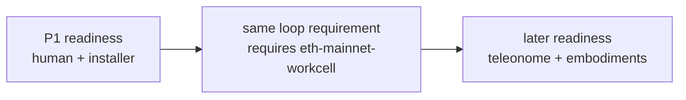


---


## Loop Requirements

Loops should declare what they need.


```synlang
(loop-requires relay-halo-spark-term
   (sigils [CHAINREAD SHA256 ADD EQ])
   (bindings [chainread-eth-mainnet-v1])
   (workcells [eth-mainnet-workcell])
   (tests [chainread-conformance-v1]))
```


Boot can refuse to start a loop if its requirements are not satisfied.


---


## Runtime Call Path

What happens during normal operation.


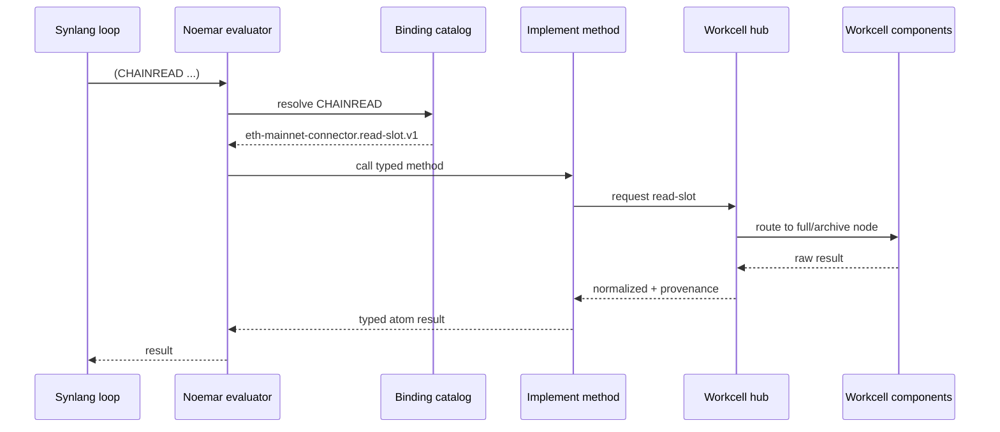


---


## Bootstrap Is Different

Normal loops can use bound sigils.

They cannot rewrite the executable substrate.


```text
ordinary loop:
  calls CHAINREAD

bootstrap:
  materializes implement code
  binds CHAINREAD
  registers workcell hub path
```


Bootstrap has birth powers.

Loops have runtime powers.


---


## One-Shot Bootstrap Space

```text
&core.bootstrap
```


Privileged.

Runs once.

Then becomes inert.


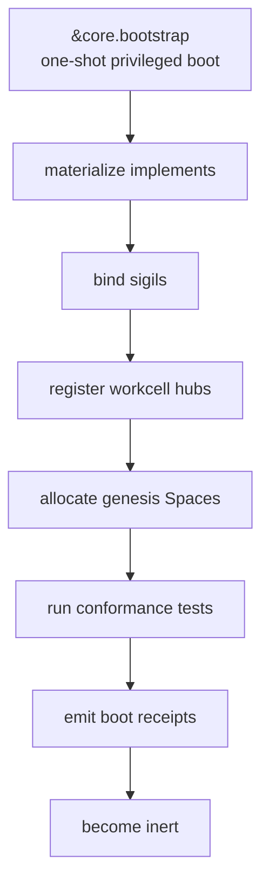


---


## Boot Powers

These are not ordinary loop powers.


```text
MATERIALIZE-IMPLEMENT
  write verified implement artifact to local path

BIND-SIGIL
  bind sigil to implement method path

REGISTER-WORKCELL-HUB
  attach workcell name to local hub endpoint

ENABLE-LOOP
  start loop only after requirements pass
```


Think:

```text
boot-only Noemar-native capabilities
```

Not:

```text
ordinary synlang powers
```


---


## Installer World

The installer is a normal program.

It bridges humans and synome birth.


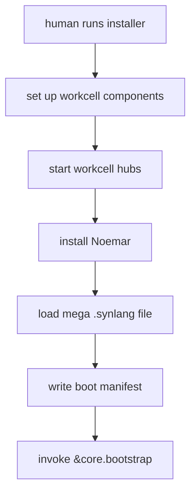


---


## Boot Manifest

The installer hands bootstrap the local facts.


```text
boot-manifest:
  noemar-version: ...
  noemar-path: ...

  synome-artifact:
    path: laniakea-p1.synlang
    hash: sha256:...

  implements:
    eth-mainnet-connector-v1:
      materialized-path: /opt/noemar/implements/...
      hash: sha256:...

  workcell-hubs:
    eth-mainnet-workcell:
      endpoint: http://127.0.0.1:8547

  test-forks:
    synome-shadow: enabled
    eth-mainnet-fork: enabled
```


No need for signed readiness atoms in P1.

The manifest is an installer output.


---


## Mega .synlang File

The genesis artifact can contain:

```text
Space definitions
loop bodies
sigil catalog
binding catalog
implement artifact refs or source strings
workcell specs
test definitions
bootstrap recipe
```


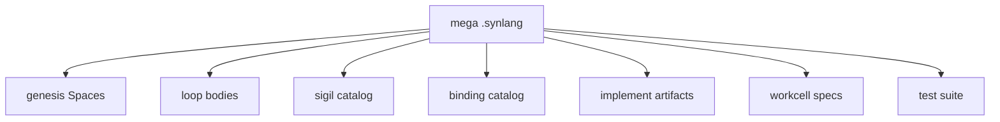


---


## Boot Flow

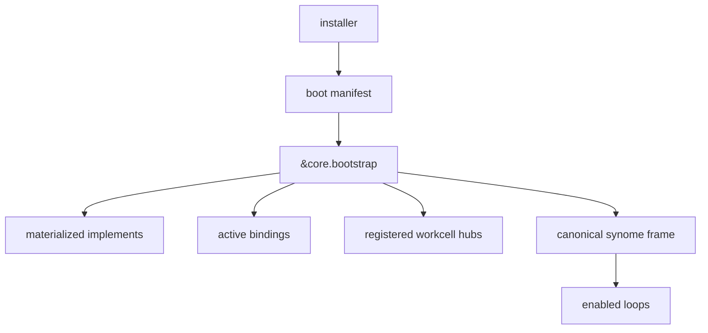


---


## Test Setup

After canonical genesis:

```text
fork synome
fork chain
bind shadow to forked workcells
run tests
discard or keep for dev
```


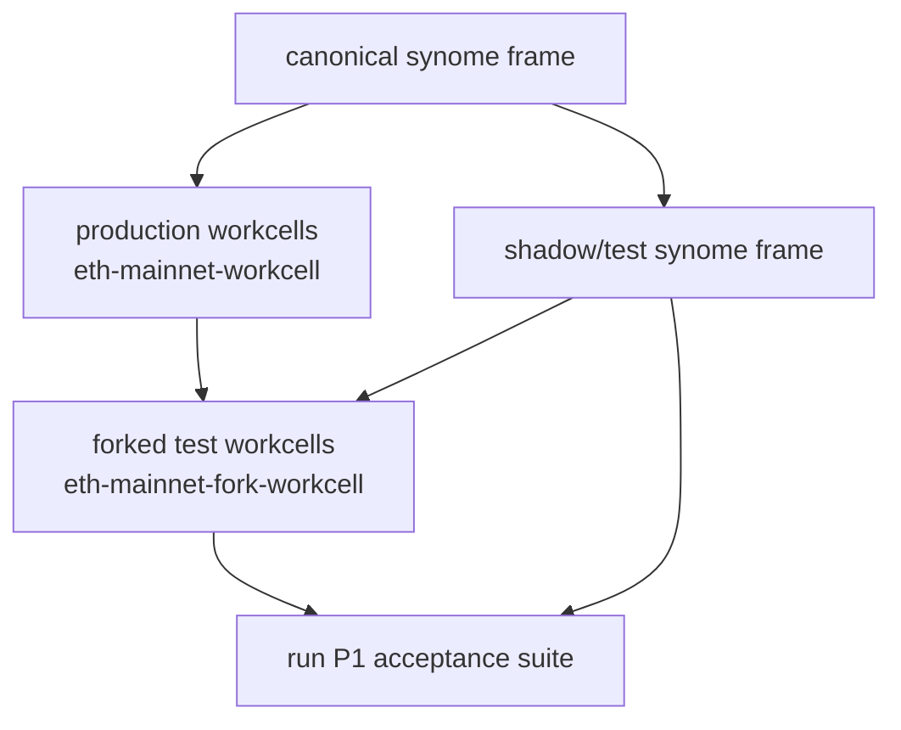


---


## Production vs Shadow Binding

Same sigil.

Different frame.

Different workcell hub.


```text
production frame:
  CHAINREAD -> eth-mainnet-connector.read-slot.v1
            -> eth-mainnet-workcell-hub

shadow frame:
  CHAINREAD -> eth-mainnet-connector.read-slot.v1
            -> eth-mainnet-fork-workcell-hub
```


This lets the same synlang run against production or test reality.


---


## P1 Safety Boundary

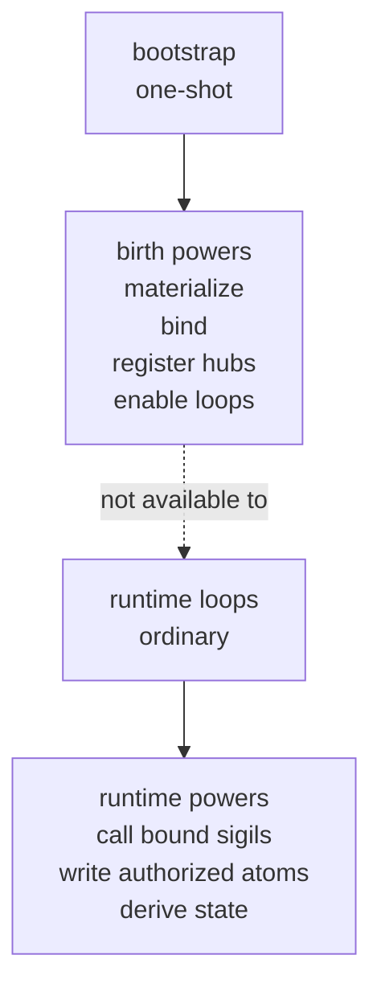


Key rule:

```text
Bootstrap can create and bind the executable substrate.

Ordinary loops can only use already-bound sigils.
```


---


## P1 Example: CHAINREAD

```synlang
(CHAINREAD ethereum
   collateral-account-001
   (balance btc)
   $block-ref)
```


```text
sigil:
  CHAINREAD

binding:
  chainread-eth-mainnet-v1

implement method:
  eth-mainnet-connector.read-slot.v1

workcell hub:
  eth-mainnet-workcell-hub

workcell components:
  full node
  archive node
  RPC endpoint
```


---


## P1 Example: Risk Heartbeat

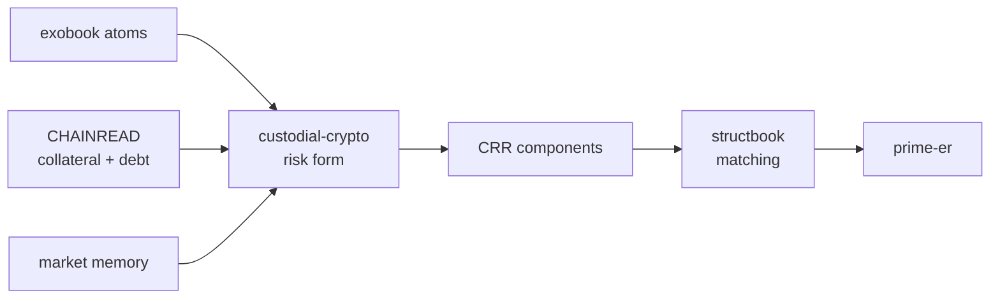


The risk form does not care how `CHAINREAD` is backed.

It only needs the bound sigil result.


---


## What The Team Builds

```text
Noemar core
  parser
  atom classifier
  evaluator
  special forms
  literal handling

Sigil layer
  sigil catalog
  binding catalog
  implement artifact materialization
  binding resolver

Workcell layer
  workcell specs
  workcell hubs
  component setup docs
  hub conformance tests

Installer / boot
  installer
  boot manifest
  &core.bootstrap
  shadow synome + forked chain setup
```


---


## Final Mental Model

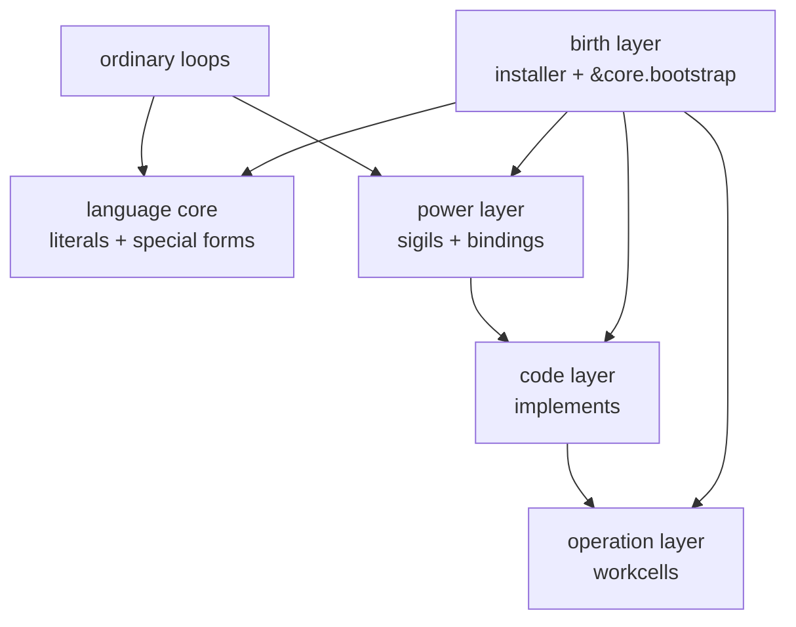


One sentence:

```text
Noemar gives synlang a small fixed core and a governed way to call real-world powers.
```


---


## The Important Boundary

```text
The synome can name powers.

Bindings wire those powers to code.

Code calls workcell hubs.

Workcells touch the world.
```


```text
P1:
  humans and installer prepare workcells

later:
  teleonomes and embodiments operate workcells
```


The read path stays stable.

The provenance gets better.
