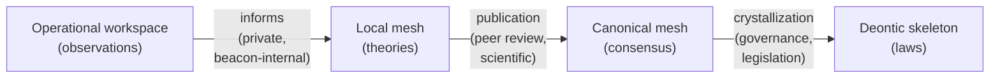
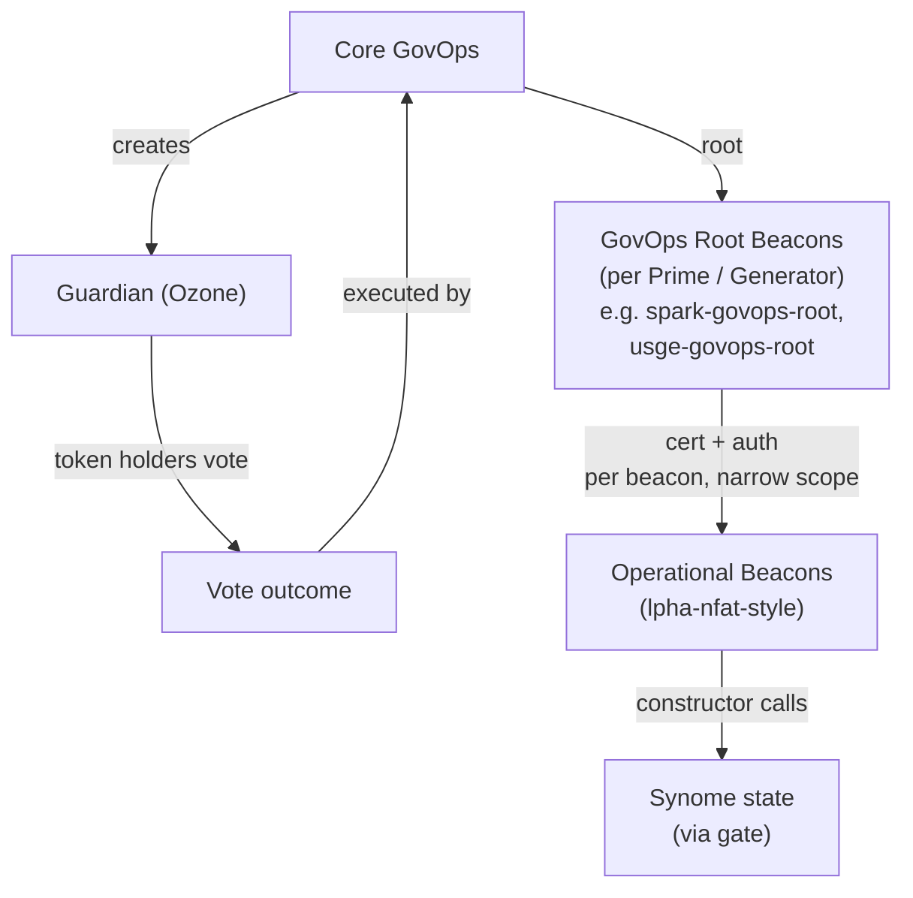
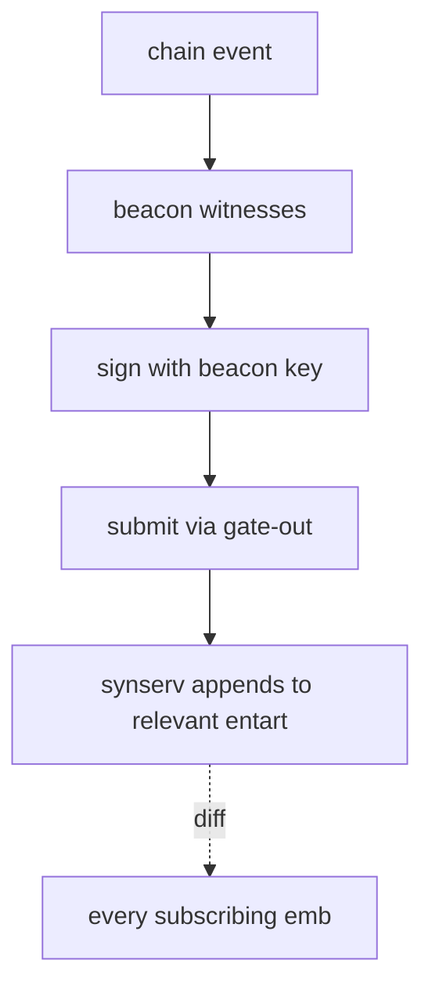
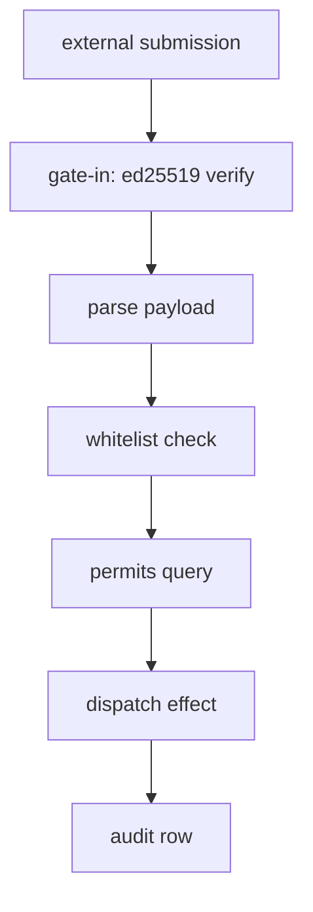
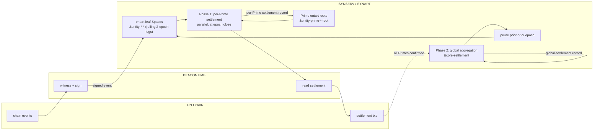

# Synomics Overview — Concept Map

Tight reference of the bits and pieces that have to be woven together.
Each section is a pointer, not an explanation. Reach for `noemar-synlang/topology.md`
(structural definitions), `synodoxics/noemar-substrate.md` (artifact tiers
synart/telart/embart + Noemar runtime), `synoteleonomics/recipe-marketplace.md`
(recipe marketplace canonical home), `noemar-synlang/boot-model.md` (identity-driven boot),
`noemar-synlang/scaling.md` (operational concerns),
`noemar-synlang/settlement-cycle-example.md` and
`noemar-synlang/telseed-bootstrap-example.md` (worked examples),
`noemar-synlang/runtime.md` (auth + runtime), `noemar-synlang/synlang-patterns.md`
(code library), or `inactive/archive/govops-synlang-patterns.md` (historical demo) when
depth is needed.

This doc is the **canonical home for the five levels of self-reference**
(§10.5). Other docs reference here.

---

## 1. Four-tier architecture

Two replicated/canonical layers (shared) plus two private layers (per-entity).
The hardness/replication gradient runs top-to-bottom; the type of "data" runs
from rules → knowledge → theories → activity.

| Tier | Analogy | Content | Replication | Mutability |
|---|---|---|---|---|
| Deontic skeleton | Laws of the land | Hard rules + hard state — `(1,1)` | Canonical, gate-mediated | Append-only / governance-revocable |
| Canonical probmesh | Wikipedia / peer-reviewed science | Shared knowledge — `(s,c)` | Canonical, gate-mediated | Belief-revisable via new evidence |
| Local probmesh | Private research notebooks | Per-teleonome reasoning, hypotheses, theories | Never replicated | Free local mutation |
| Operational workspace | Lab bench / tracking sheet | Per-loop chain observations, in-flight derivations, ephemeral computation state | Never replicated, often ephemeral | Free local mutation; routinely discarded |

The first three are about **what is believed/known**; the fourth is about **what is currently happening**. Different layer of the stack — operational, not epistemic — but it lives in the same atomspace machinery and is the substrate where actual cognition / computation happens turn-by-turn.

**Hardening pipeline** runs through three gates:



| Gate | Source → Target | Mechanism |
|---|---|---|
| Inform | Operational → Local mesh | Private; the teleonome notices its own observations, builds theories |
| Publication | Local mesh → Canonical mesh | Peer-review-shaped; submitted, vetted, accepted into the encyclopedia |
| Crystallization | Canonical mesh → Deontic skeleton | Governance-shaped; (s,c) → (1,1), legislation pace |

Each gate has different cadence, authority, failure mode. The first is private and continuous; the third is rare and deliberate.

---

## 2. What lives where

| Concept | Substrate | Notes |
|---|---|---|
| **Synome** | Replicated atomspace | The data layer — agents, governance, canonical knowledge live here as facts |
| **Synart** | The canonical part of the synome | Tree of entarts (per `noemar-synlang/topology.md`) plus universal `&core-*` Spaces |
| **Synserv** | The synome server (canonical instance) | The machine(s) Core GovOps runs to host canonical state |
| **Synomic agent / synent** | Atoms in the synome | Data, not processes. Guardian / Prime / Halo. Each owns an **entart**. |
| **Embodiment** | A machine running a synome replica | Anyone can run one; may sync full synart or a subset |
| **Beacon** | Process on an embodiment | The only way agents act on the world; certed in a Guardian, authed in entart subtrees |
| **Core GovOps** | Operational role running synserv + rooting other GovOps | Bootstrapped genesis-style; can give/revoke root to other Core GovOps recursively |
| **GovOps team** | Humans operating beacons under a specific Guardian | The "private company" running e.g. Spark — *external operator*, not an entart |
| **Chain** | EVM contracts (PAU stack) | Source of truth for chain-side facts; opaque to synome |

---

## 3. Blockchain analogy (sharp)

| Crypto | Sky/Laniakea |
|---|---|
| Chain state | The synome (synlang facts + rules) |
| Full nodes | Embodiments running the spec |
| Sequencer | Core GovOps running synserv (permissioned) |
| Tx senders | Beacons |
| Tx | Signed gate message |
| Smart contracts | Synlang rules |
| Offchain workers | Embodiment doing local heavy compute |
| Posting a result | Beacon emits attested fact via gate |
| Fraud proof | Governance investigation (compliance officers, not slashing) |

---

## 4. Trust model

- Regulated entities with legal accountability operating beacons under governance authority.
- ed25519 sigs for **non-repudiation**, not trustlessness.
- Cert chain carries real-world liability up to the Guardian.
- Disputes: governance writes a `finding` atom that supersedes the original.
- Cert revocation, legal recourse, compliance-officer audits do the work crypto would do in a permissionless system.
- Crypto becomes load-bearing later (federation, anonymous beacons, volume past governance capacity) — not now.

---

## 5. Authority chain



- **Core Council** — sovereign-rank synomic agent. Authority body for Guardian creation; not directly operational. Core GovOps does the actual writing.
- **Guardian (Ozone)** — created by Core GovOps. The single operational guardian. Backed by token holders who vote on which GovOps teams to root under it. Owns an entart (`&entity-guardian-ozone-root`). All operational entities (USGE Generator, Spark/Grove/Keel/Obex Primes, and others as added) are direct children of Ozone in the accordancy graph.
- **Core GovOps** — operational role. Bootstrapped genesis-style: the original Core GovOps are whoever runs the first synserv. They can give and revoke root to other Core GovOps recursively. They are the operational executor for both Guardian creation and rooting regular GovOps (executing Guardian token-holder votes).
- **GovOps team** (e.g. the Spark operator, the USGE operator) — *external operator*, not in the tree. Rooted under Ozone by Core GovOps on token holders' behalf. Each GovOps team operates the entity it administers (Spark Prime, USGE Generator, etc.) day-to-day via beacons. Multiple GovOps teams coexist under Ozone; each is scoped to its administered entity.
- **GovOps root beacon** — operational top of a GovOps team. Certifies operational beacons with narrow auths.
- **Operational beacons** (lpha-nfat-style) — the actual write-doers. Carry narrow auths, scoped to specific verbs on specific targets.

| Concept | Asserts | Frequency | Where it lives |
|---|---|---|---|
| Governance accord | Mutual recognition between synomic agents | Long-lived, structural | Parent entart's sub-entart registry |
| Admin certification | "This beacon is mine; I carry liability" | Operational | Guardian's entart root |
| Admin authorization | "This beacon may do verb V on target T" | Operational, frequent | Entart owning the target |

The simplified permission rule body is `(if (auth $beacon $verb $target) True False)` — see §16 below.

---

## 6. Halo / Class / Book / Unit — conservation network

> **Books balance. Units bridge. Everything else is metadata.**

| Layer | What it is | What it controls |
|---|---|---|
| **Halo Class** | Shared smart-contract infra | PAU, buybox, factory template, beacon set |
| **Halo Book** | Balanced bankruptcy-remote ledger | Risk isolation, pari passu losses |
| **Halo Unit** | Connecting edge between books | Specific terms, holder, claim |

A unit is a liability in its issuing book, an asset in the holding book — one atom, two views via bridging rules (see `noemar-synlang/synlang-patterns.md` §2).

**Book lifecycle:** `created → filling → offboarding → deploying → at-rest → unwinding → closed`

**Two-beacon deployment gate:** `lpha-attest` posts attestation flag → `lpha-nfat` reads flag → transitions book to `deploying`.

In the entart tree, books live as leaf Spaces under their owning Halo: `&entity-halo-<id>-book-<id>`.

---

## 7. Risk framework → encumbrance

Per-position capital is computed via the layered risk framework: Riskbook category match produces the per-position CRR (default risk + currency translation + tactical hedging via the category equation); Halobook declares bundle exposure structure (P + T); Primebook routes the Halobook unit to a typed sub-book (`ascbook` / `tradingbook` / `termbook` / `structbook` / `hedgebook` / unmatched), and the sub-book determines which non-default risks are covered by structure vs require capital.

```metta
;; sketch — full machinery in laniakea-docs/risk-framework/
(= (position-capital $position)
   (let* (($cat       (riskbook-category-match $position))
          ($base-crr  (eval-category-equation $cat $position))
          ($subbook   (route-to-sub-book $position))
          ($blended   (sub-book-blend $subbook $position $base-crr)))
     (* (notional $position) $blended)))

(= (trrc $prime)
   (+ (sum-over-positions (lambda ($p) (position-capital $p)))
      (concentration-excess-penalties $prime)))

(= (er $prime)
   (/ (trrc $prime) (available-capital $prime)))
```

State-based CRR (`(crr filling 5)` / `(crr deploying 100)` etc.) is gone. Lifecycle phases now manifest as different exo units pointing to different exo books with different categories — the math reads structure, not phase labels.

**Covenant:** ratio ≤ 0.90. Breach drives penalties at settlement.

For the full conceptual core, see `risk-framework/risk-decomposition.md` and `risk-framework/book-primitive.md`. For the worked v1 crypto-collateralized lending test, see `risk-framework/examples.md`. For the Phase-1-era settlement cycle (uses old state-based CRR for illustration), see `noemar-synlang/settlement-cycle-example.md`.

---

## 8. Settlement (two phases)

At each settlement boundary (Phase 1: monthly; Phase 2+: daily). Inputs are the just-completed epoch's event log + governance facts.

**Phase 1 — Per-Prime settlement (parallel across all Primes):**

| Step | What | Direction |
|---|---|---|
| 1 | Max debt fees | Prime owes |
| 2 | Idle reimbursement | Credit to Prime |
| 3 | Distribution rewards | Credit to Prime |
| 4 | Sky Direct reimbursement | Credit to Prime |
| — | Breach penalty | Prime owes |
| — | Synart resource consumption | Prime owes |
| = | **Net owed** | Prime settles on-chain |

Each Prime's computation runs against its own `&entity-prime-<id>-root` and the leaf book Spaces below it. Settlement record is written into the Prime's entart root. No cross-Prime coordination in Phase 1.

**Phase 2 — Global aggregation (after Phase 1 on-chain confirmations):**

Synserv reads all per-Prime settlement records and aggregates into the universal `&core-settlement` Space:

| Aggregate | Source |
|---|---|
| Total Sky income (debt fees + penalties + resource fees) | Σ across Primes |
| Total Sky outflow (idle + distribution + Sky Direct) | Σ across Primes |
| **Sky net for the day** | Income − outflow |
| Treasury / Sky Token allocation | Sky-net × governance split |
| Ecosystem fund allocation | Sky-net × ecosystem split |

`&core-settlement` is universal — every emb sees it regardless of subscription depth.

---

## 9. Real-time event streaming

Prime beacons and Halo beacons stream events into the synart as they happen on chain. Each event is one signed atom, gate-verified by synserv, appended to the canonical synart in the relevant entart Space. **The synart itself is the canonical real-time event log.**

Properties:

- **Source of truth.** Computations against synart are canonical because synart has the real data — no optimistic-trust + challenge-based recourse layer needed for operational state.
- **Live derivations.** Encumbrance ratio, idle balances, debt positions, distribution entitlements — all live queries against current synart state. Frontends, monitoring, and other teleonomes read whatever they need at whatever cadence they want.
- **Synserv computes settlement.** At each settlement boundary, synserv runs the full epoch settlement computation itself, against its own event log. No external accrual server tier.
- **Rolling two-epoch retention.** Synart always holds the most-recently-settled epoch alongside the currently-streaming one (per Space). Pruning happens at the *next* settlement: when epoch N is settled, epoch N−1's events are pruned. The on-chain transactions are the long-term historical canonical record.
- **Self-regulating volume via pricing.** Each agent pays for synart resources they consume — see §19. Tragedy of commons handled by economic gating, not architectural restriction.

---

## 10. The replicated synart — an entart tree

Synart is not one logical Space but a **tree of entarts** rooted at `&core-root`, plus the universal `&core-*` layer (see `noemar-synlang/topology.md` §5–§6). Synserv is the canonical instance; embs receive append-only diffs continuously.

**Subscription is per-entart, not all-or-nothing.** A serious teleonome may sync the whole tree; a light embodiment may sync just one Prime's USDS book leaf. Both are first-class. The universal `&core-*` Spaces (constitutional, framework, registry, aggregation, executable, library) are replicated everywhere.

**Invariant:** synart content is identical on every emb that subscribes to a given Space (modulo diff lag). Beacons never write directly — their events go through synserv's gate, get appended canonically, mirror back via the next diff.

**Synart is also the program.** Loops, gates, and recipes live as Spaces in the executable layer (`&core-loop-*`, `&core-syngate`, `&core-telgate`, `&core-recipe-*`). A runtime instance becomes a participant in the synome by booting against the synart with an identity — the identity resolves to a loop pointer; the runtime evaluates that loop. Spaces aren't just data containers; they're the program that the runtime interprets. See `noemar-synlang/boot-model.md` for the boot mechanics.

(Local probmesh remains its own per-teleonome telart tree — orthogonal to the canonical synart. See `synodoxics/noemar-substrate.md` for the full three-tier artifact treatment.)

---

## 10.5. The five levels of self-reference

The synart's self-hosting properties stack into five levels:

1. **Self-hosting** — synart contains the loops that run synart. The
   synserv loop is in `&core-loop-synserv`; beacon loops are in
   `&core-loop-beacon-*`; sentinel loops in `&core-loop-sentinel-*`.
   Identity-driven boot picks them up.

2. **Self-regulating** — synart contains the gates that regulate synart
   access. `&core-syngate` is the synserv's gate; `&core-telgate` is
   the universal spec each tel runs an instance of. The trust boundary
   is itself synart code.

3. **Self-paying** — synart contains the recipes that fund work on synart.
   Recipes (see §19.5) bundle loops with economics; teleonomes earn
   carry by running them. The marketplace that pays for participation
   is part of the substrate participants run on.

4. **Self-seeding** — synart contains the telseeds that birth new
   teleonomes (`&core-library-telseed-*`). New tels boot against synart
   and grow from there. The reproductive material is in the substrate.

5. **Self-improving** — synart contains the runtime source itself
   (`&core-library-runtime-noemar-*` and alt impls). Recipe revenue
   funds substrate research; substrate research lands back in synart;
   next-generation tels start from improved foundations. **The synome
   funds its own substrate research with the value it captures from
   substrate use.**

This is structurally tighter than open-source models (where development
is funded externally) or smart-contract platforms (where contracts run
on chains the contracts didn't fund). The marketplace running on the
substrate pays for the substrate's improvement; you can't fork the
development engine without forking the productive economy.

For the boot mechanics enabling level 1: `noemar-synlang/boot-model.md`. For the
artifact tiers (synart/telart/embart): `synodoxics/noemar-substrate.md`. For the
recipe marketplace canonical home (level 3): `synoteleonomics/recipe-marketplace.md`.

---

## 11. The settlement cycle (cadence-agnostic)

Synart maintains a **rolling two-epoch window** (per Space): each entart Space holds the most-recently-settled epoch alongside the currently-streaming one.

```mermaid
gantt
    title Settlement cycle (T = epoch close)
    dateFormat HH:mm
    axisFormat T+%H:%M
    section Operations
    Real-time event streaming         :active, m1, 00:00, 24h
    section Per-Prime settlement
    Per-Prime computations (parallel) :crit, m2, 24:00, 30m
    Prime beacons settle on-chain     :crit, m3, 24:30, 90m
    section Global aggregation
    Synserv aggregates global numbers :crit, m4, 26:00, 30m
    Prune prior-prior epoch           :m5, 26:30, 30m
```

The cycle:

- **Continuous (T → T+epoch-length):** Prime and Halo beacons stream chain events into their respective entart Spaces. The previously-settled epoch is retained alongside the currently-streaming one.
- **T+epoch-length:** Epoch N closes. Synserv runs **per-Prime settlements in parallel** — each Prime's net-owed computed independently against its own entart subtree.
- **+30m:** Prime beacons read their settlement records and execute on-chain settlement transactions.
- **+2h:** Once all per-Prime on-chain settlements confirm, synserv runs **global aggregation** — sums revenue / outflow / net across all Primes, writes treasury and ecosystem allocations to `&core-settlement`.
- **+2.5h:** Per-Space pruning kicks in. Each Space drops its prior-prior epoch independently.

Two-phase by data dependency: Phase 1 is parallel because each Prime's data is independent; Phase 2 is sequential because aggregation needs all Phase-1 outputs. Frontends and other readers query synart directly at whatever cadence they want — daily is the only canonical aggregation boundary, but real-time reads are continuous.

---

## 12. The beacon flow



In steady state the beacon's job is just: witness chain events, sign, submit. One event per submission. No per-cycle accrual building, no local aggregation, no snapshot computation.

At settlement time, Prime beacons additionally:

- Read the settlement record synserv computed for their Prime (in `&entity-prime-<id>-root`)
- Execute on-chain settlement transactions per those numbers
- Wait for confirmation; synart pruning follows

That's the only periodic act in the beacon's loop. Otherwise it's a continuous streaming process.

---

## 13. Spaces — what they actually buy

| Real wins | Not real wins |
|---|---|
| Replication topology granularity (per-entart subscription) | Raw query perf (indexes do that) |
| Lifecycle isolation (archive closed entities) | Trust separation within one runtime |
| Mobility / repartitioning unit | Failure isolation (discipline does this) |
| Fork-promote / staging (RSI, mesh) | Most "scaling" claims |
| Independent runtime versioning | |
| Conceptual / authority alignment (entart = synent) | |
| Executable specifications co-located with state (loops, gates, recipes are atoms) | |

**Skeleton (deontic):** the entart tree per `noemar-synlang/topology.md`. Multi-Space, but each Space's role is structural-authority, not throughput.
**Canonical probmesh:** genuinely multi-Space (domains, hypothesis testing, PIM mapping).
**Local probmesh:** per-teleonome plus fork-promote staging.

---

## 14. Loop taxonomy

Embodiments are configured by which loops they activate. Each loop owns a **workspace Space** in embart — the operational tier in concrete form.

| Loop | Activates | Args | Workspace contents |
|---|---|---|---|
| `server` | synome-gate, write acceptance, replication out | governance-replica? | gate-in queue, replication cursor |
| `beacon` | one beacon's heartbeat + gate-out | role, target, cadence | chain obs, accruals-in-flight, derivation state |
| `archive` | full event capture | scope, retention | full historical event log |
| `verifier` | re-derive + flag discrepancies | scope, cadence | mirrored events, challenge drafts |
| `endoscraper` | chain RPC poll + parse + write | protocol target, cadence | per-cycle chain events, processing scratch |
| `dreamer` | evolutionary simulation in dreamart | population size, fitness fn | candidate strategies, simulated worlds |
| `sentinel-baseline` | baseline strategy with synart envelope + designated call-outs | per-entity Space (e.g., `&entity-prime-spark-sentinel-baseline`) | active context, draft proposals, call-out state |
| `sentinel-stream` | local cognition with synart bounds | per-entity Space | rich working memory for ongoing local cognition |
| `sentinel-warden` | re-runs baseline; halts on disagreement | per-entity Space | re-derived expected baseline, comparison state |

**All loop bodies are synart-resolved Spaces.** The taxonomy here shows which loops an embodiment activates (which identity it boots as / which class it registered for), not where the loop code lives. Code is universal in `&core-loop-*` (and per-entity instances in entarts for entity-bound loops); embart holds only execution context per running loop. See `noemar-synlang/boot-model.md` and `noemar-synlang/topology.md` §17 for mechanics.

Loops compose on one embodiment. Same runtime, different activations.
Workspaces are the operational-tier Spaces — private, ephemeral, never gated.

---

## 15. Pipeline shape (gate → policy → effect → audit)



1. **parse payload** — fail on malformed.
2. **whitelist check** — `head ∈ external-verb` allowlist.
3. **permits query** — `(permits $beacon $action) → True?`
4. **dispatch effect** — Python effect runs structural validation + writes.
5. **audit row** — accepted or denied with reason.

Authority lives **only** in step 3.

---

## 16. Permission rule template

The leaf `auth` fact is the source of truth. No class/role/status preamble — those properties are governance's concern at grant-time, not the rule's concern at check-time.

```metta
(= (permits $beacon (VERB $target $args… $nonce))
   (if (auth $beacon VERB $target)
       True
       False))
```

- `(auth $beacon $verb $target)` is a flat 3-arg fact. Lives in the entart owning the target. Granted by a certifier (whose own auth chain ultimately roots in genesis); removed on revocation.
- `(if … True False)` wrapper forces a definite boolean (bare expressions don't reduce).
- Trailing `$nonce` — driver-appended, body ignores. Replay protection.
- Default-deny by absence — no `auth` atom → no `permits` results → policy denies.

If a beacon's role / class / status changes (e.g., decertified, reassigned), governance revokes the relevant `auth` atoms. Synlang never re-verifies those properties — it just reads the auth fact.

> The runnable demo (`inactive/archive/govops-synlang-patterns.md`) uses a longer preamble (`in-class` + `beacon-role` + `beacon-status` + flat checks). The auth-only shape above is the canonical successor — see that doc's header note.

---

## 17. Failure / escalation

Failure modes shift from "missing accruals" to:

- **Beacon drops events** → synserv / archive nodes detect gaps via on-chain comparison; flagged with an `event-gap-flagged` atom.
- **Settlement disagrees with chain** → synserv's computed settlement diverges from on-chain reality; flagged into `&core-escalation` for governance review.
- **Agent under-pays for resources** → synserv tracks consumption; if a meter shows non-payment, escalation flag.
- **Beacon misbehavior** → cert/auth chain provides recourse: revoke the auth atom, re-cert from above, etc.

All flagging atoms are append-only; the audit trail is part of synart history *until pruning at settlement*. Anything that needs to persist beyond an epoch must be promoted to a settlement-tier atom or written to an out-of-band archive. Serious breaches escalate via real-world governance — cert revocation, legal liability up the chain.

---

## 18. Phase 1 commitments

Thirteen commitments — write code as if multi-Space, run single-Space. See `noemar-synlang/topology.md` §19 for the full canonical list and `noemar-synlang/runtime.md` §17 for full rationale on the original seven.

The high-level shape:

1. Space is always a parameter, never implicit.
2. Append-only writes.
3. Content-addressed names.
4. Open verb dispatch via `(external-verb …)` whitelist.
5. Gate as primitive at the trust boundary, even if trivial.
6. `(can $caller $verb $target)` reads from a named auth Space.
7. Idempotent constructors.
8. Every rule declares its reads (`rule-reads`).
9. Cross-Space references go through registries, never hard-coded names.
10. Cross-Space rules are scatter-gather, not direct multi-match.
11. Global rules carry their own publication metadata.
12. Synart is a tree of entarts; cross-entart references go parent → child only.

Cheap insurance. Lets future sharding / migration / federation happen without synlang rewrites.

---

## 19. Scaling economics

The synart is real-time canonical state replicated across embs. Volume is regulated economically — each agent pays for the synart resources they consume.

Four pricing levers, all governance-set facts (`&core-framework-fee`):

| Lever | Who pays | Why |
|---|---|---|
| Per-atom write | Posting agent | Use of canonical write capacity |
| Per-atom-day retention | Posting agent | Storage on synserv + every replicating emb |
| Per-byte replication out | Receiving emb | Bandwidth from synserv |
| Per-match query | Querier | CPU/index time on synserv |

Properties:

- **Parsimony falls out automatically.** A Halo posting 1 event/sec instead of 10/sec pays 10× less. Natural equilibrium: post what's worth posting at the cadence it's worth at.
- **Velocity isn't suspect — just expensive.** Legitimate high-frequency operations pay accordingly; teleonomes consuming that fine resolution effectively subsidize via their bandwidth-out costs.
- **Pricing is a governance lever.** Adjust the curves to encourage / discourage behaviors. Standard fee-curve mechanism design.
- **Aligns with settlement.** Each agent's net-owed includes synart resource consumption alongside base rate, reimbursements, distributions, penalties.

For operational failure modes (replication staleness, hot-spotting, partitions), see `noemar-synlang/scaling.md`.

---

## 19.5. The recipe marketplace

The synart isn't just self-hosting and self-regulating; it's also a
**regulated marketplace for monetizing AGI capability**. Recipes (loops
in `&core-loop-*` bundled with economics in `&core-framework-fee` and
auth requirements) are the standardized products. Teleonomes are
diversified providers — they take on multiple recipes that all draw
from the same telart cognitive substrate, so transfer learning across
recipes is the economic engine.

Phase 1 has minimal recipes (deterministic verifier-shaped beacons with
small carry); high-value cognitive recipes (Sentinel formations) enter
the catalog at Phase 9-10+.

The alignment claim: **the synart, not the teleonome, decides what gets
paid for.** Recipe catalog curation is governance's most consequential
ongoing activity — it's the value-extraction surface that determines
which capabilities flow where. A rogue teleonome with infinite AGI can
only cash in on activities the synart has standardized into recipes;
the cognition can be opaque, but what it does *to the world* must flow
through a recipe.

Canonical treatment: `synoteleonomics/recipe-marketplace.md` (recipe lifecycle, transfer
learning argument, alignment claim, pricing levers, Phase 1 minimalism).

---

## 20. The one-line glue

A Prime borrows USDS from a Generator (Sky Debt). The risk framework assigns a CRR to each asset in each Halo book based on book state. A unit's risk weight = principal × CRR. Encumbrance ratio = Σ unit-risk-weights ÷ available capital; covenant ≤ 0.90. Prime and Halo beacons stream chain events into their respective leaf Spaces in the canonical synart in real time — replicated to every subscribing emb. At each settlement boundary the synserv runs **two phases**: first, per-Prime settlements compute in parallel against each Prime's own entart subtree (base rate + reimbursements − distributions + breach penalties + synart resource consumption); Prime beacons execute results on chain. Second, after confirmations, synserv aggregates across all Primes and writes global outputs (Sky-net, treasury allocation, ecosystem allocation) to `&core-settlement`. After that, each Space's *prior-prior* epoch is pruned. Beacons are gate-verified via cert/auth chain; disputes resolve via real-world governance, not crypto.

---

## 21. The data flow in one picture



Steady-state: events flow chain → beacon → entart leaf Spaces in synart, replicated selectively to embs. At each settlement boundary: synserv computes per-Prime settlements in parallel, Prime beacons settle on chain, then global aggregation runs, then per-Space pruning kicks in.

---

## File map (deeper material)

| File | When to open |
|---|---|
| `noemar-synlang/topology.md` | Canonical structural reference: entart tree, six-layer synome root, four meta-patterns, naming convention, thirteen commitments, two-step rule and loop shapes |
| `synodoxics/noemar-substrate.md` | Synart / telart / embart artifact tiers; telseeds; Noemar and atomspace runtimes — the substrate the synomics architecture rests on |
| `synoteleonomics/recipe-marketplace.md` | *Canonical home for the recipe marketplace* — recipe lifecycle, transfer learning, pricing levers, alignment claim |
| `noemar-synlang/risk-framework.md` | Four-book taxonomy (Primebook/Halobook/Riskbook/Exobook); risk categories at three levels (exo asset / exobook / riskbook) with parameterized stress-simulation equations; four-tier resolution hierarchy; *canonical home for the content-based risk model and the default-deny CRR 100% rule* |
| `noemar-synlang/boot-model.md` | Identity-driven boot — how `noemar boot` resolves to a running loop; spec/instance collapse; shadow execution |
| `noemar-synlang/telseed-bootstrap-example.md` | Worked trace of the first 24 hours of a new teleonome from a fresh telseed |
| `noemar-synlang/scaling.md` | Operational concerns: synserv as single sequencer, replication, partial sync, hot-spotting, partitions, testing strategy |
| `noemar-synlang/settlement-cycle-example.md` | Worked end-to-end example: ER tracking, breach, penalty calculation (uses old state-based CRR; see `noemar-synlang/risk-framework.md` §7 for the new content-based model) |
| `noemar-synlang/runtime.md` | Auth domains, three-level model (root/cert/auth), gate primitive, heartbeat, 16 migration principles, original 7 commitments, identity-driven boot summary, call-out primitive summary |
| `noemar-synlang/synlang-patterns.md` | Synlang code library: Platonic kernel, cross-book duality, four-constructor MeTTa surface, sentinel decision rule (RAR), call-out primitive code, sentinel formation patterns |
| `inactive/archive/govops-synlang-patterns.md` | Working pattern catalog from runnable govops_demo (historical demo state) |
