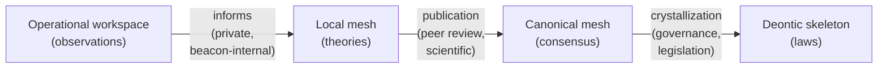
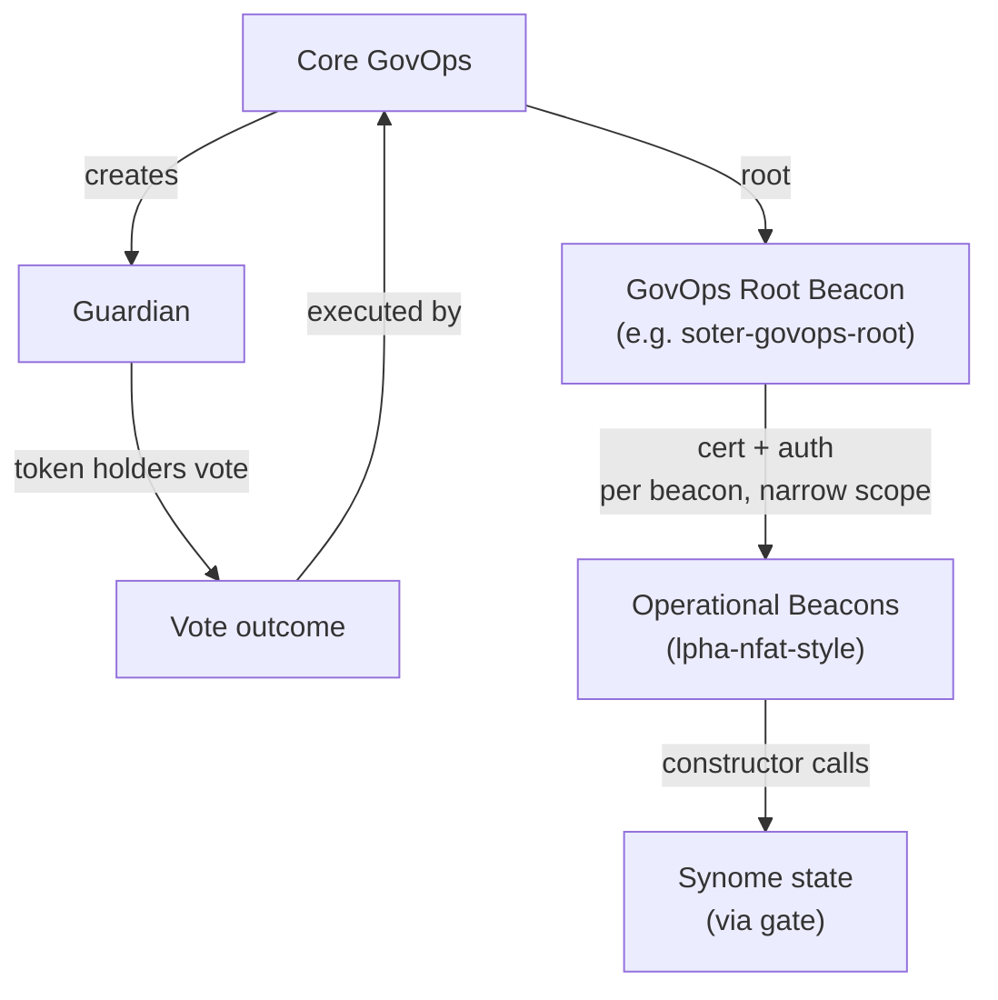
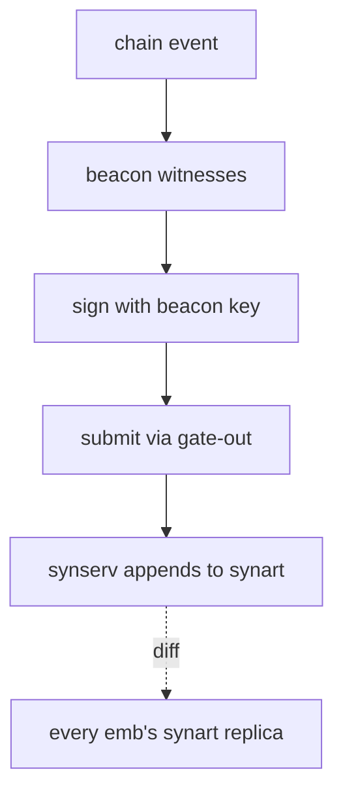
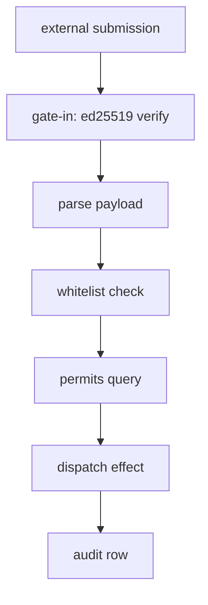
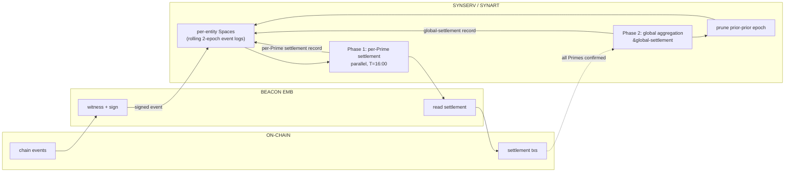

# Syn Overview — Concept Map

Tight reference of the bits and pieces that have to be woven together. Each
section is a pointer, not an explanation. Reach for `synlang-context.md`,
`synart-access-and-runtime.md`, `govops-synlang-patterns.md`, or
`synlang-iteration-primer.md` when depth is needed.

---

## 1. Four-tier architecture

Two replicated/canonical layers (shared) plus two private layers (per-entity).
The hardness/replication gradient runs top-to-bottom; the type of "data" runs
from rules → knowledge → theories → activity.

| Tier | Analogy | Content | Replication | Mutability |
|---|---|---|---|---|
| Deontic skeleton | Laws of the land | Hard rules + hard state — `(1,1)` | Canonical, gate-mediated | Append-only / governance-revocable |
| Canonical probmesh | Wikipedia / peer-reviewed science | Shared knowledge — `(s,c)` | Canonical, gate-mediated | Belief-revisable via new evidence |
| Local probmesh | Private research notebooks | Per-teleonome reasoning, hypotheses, theories | Never replicated | Free local mutation |
| Operational workspace | Lab bench / current experiment / tracking sheet | Per-loop chain observations, in-flight derivations, accruals-being-built, ephemeral computation state | Never replicated, often ephemeral | Free local mutation; routinely discarded |

The first three are about **what is believed/known**; the fourth is about **what is currently happening**. Different layer of the stack — operational, not epistemic — but it lives in the same atomspace machinery and is the substrate where actual cognition / computation happens turn-by-turn.

**Hardening pipeline** runs through three gates:



| Gate | Source → Target | Mechanism |
|---|---|---|
| Inform | Operational → Local mesh | Private; the teleonome notices its own observations, builds theories |
| Publication | Local mesh → Canonical mesh | Peer-review-shaped; submitted, vetted, accepted into the encyclopedia |
| Crystallization | Canonical mesh → Deontic skeleton | Governance-shaped; (s,c) → (1,1), legislation pace |

Each gate has different cadence, authority, failure mode. The first is private and continuous; the third is rare and deliberate.

---

## 2. What lives where

| Concept | Substrate | Notes |
|---|---|---|
| **Synome** | Replicated atomspace | The data layer — agents, governance, canonical knowledge live here as facts |
| **Synserv** | The synome server (canonical instance) | The machine(s) Core GovOps runs to host canonical state |
| **Synomic agent** (Prime, Halo, Guardian, etc.) | Atoms in the synome | Data, not processes |
| **Embodiment** | A machine running a synome replica | Anyone can run one |
| **Beacon** | Process on an embodiment | The only way agents act on the world |
| **Core GovOps** | Operational role running synserv + rooting other GovOps | Bootstrapped genesis-style; can give/revoke root to other Core GovOps recursively |
| **GovOps team** | Humans operating beacons under a specific Guardian | The "private company" running e.g. Spark |
| **Chain** | EVM contracts (PAU stack) | Source of truth for chain-side facts; opaque to synome |

---

## 3. Blockchain analogy (sharp)

| Crypto | Sky/Laniakea |
|---|---|
| Chain state | The synome (synlang facts + rules) |
| Full nodes | Embodiments running the spec |
| Sequencer | Core GovOps running synserv (permissioned) |
| Tx senders | Beacons |
| Tx | Signed gate message |
| Smart contracts | Synlang rules |
| Offchain workers | Embodiment doing local heavy compute |
| Posting a result | Beacon emits attested fact via gate |
| Fraud proof | Governance investigation (compliance officers, not slashing) |

---

## 4. Trust model

- Regulated entities with legal accountability operating beacons under governance authority.
- ed25519 sigs for **non-repudiation**, not trustlessness.
- Cert chain carries real-world liability up to the Guardian.
- Disputes: governance writes a `finding` atom that supersedes the original.
- Cert revocation, legal recourse, compliance-officer audits do the work crypto would do in a permissionless system.
- Crypto becomes load-bearing later (federation, anonymous beacons, volume past governance capacity) — not now.

---

## 5. Authority chain



- **Core Council** — sovereign-rank synomic agent. Authority body for Guardian creation; not directly operational. Core GovOps does the actual writing.
- **Guardian** — created by Core GovOps. Backed by token holders who vote on which GovOps team to root under it.
- **Core GovOps** — operational role. Bootstrapped genesis-style: the original Core GovOps are whoever runs the first synserv. They can give and revoke root to other Core GovOps recursively. They are the operational executor for both Guardian creation and rooting regular GovOps (executing Guardian token-holder votes) — i.e. they're the entity that actually writes the relevant atoms.
- **GovOps team** (e.g. soter-govops) — rooted under a specific Guardian by Core GovOps on token holders' behalf. Operates the agent (Spark Prime, etc.) day-to-day.
- **GovOps root beacon** — operational top of a GovOps team. Certifies operational beacons with narrow auths.
- **Operational beacons** (lpha-nfat-style) — the actual write-doers. Carry narrow caps from their root.

| Concept | Asserts | Frequency |
|---|---|---|
| Governance accord | Mutual recognition between synomic agents | Long-lived, structural |
| Admin certification | "This beacon is mine; I carry liability" | Operational |
| Admin authorization | "This beacon may do verb V on target T" | Operational, frequent |

**Flat capability facts** replace transitive-closure walks (which fail AETHER's QR-009). Every constructor writes a flat 2-arg fact `(govops-admin $prime $beacon)` / `(halo-admin $halo $beacon)` / `(book-admin $book $beacon)`. Downstream rules check directly.

---

## 6. Halo / Class / Book / Unit — conservation network

> **Books balance. Units bridge. Everything else is metadata.**

| Layer | What it is | What it controls |
|---|---|---|
| **Halo Class** | Shared smart-contract infra | PAU, buybox, factory template, beacon set |
| **Halo Book** | Balanced bankruptcy-remote ledger | Risk isolation, pari passu losses |
| **Halo Unit** | Connecting edge between books | Specific terms, holder, claim |

A unit is a liability in its issuing book, an asset in the holding book — one atom, two views via bridging rules.

**Book lifecycle:** `created → filling → offboarding → deploying → at-rest → unwinding → closed`

**Two-beacon deployment gate:** `lpha-attest` posts attestation flag → `lpha-nfat` reads flag → transitions book to deploying.

---

## 7. Risk framework → encumbrance

```metta
(crr-factor filling   0.05)   ; transparent, on-chain
(crr-factor deploying 1.00)   ; obfuscated, Schrödinger's risk
(crr-factor at-rest   0.40)   ; attested
;; etc.

(= (unit-risk-weight $u)
   (* principal (crr-factor (book-state issuer))))

(= (encumbrance-ratio $prime)
   (/ (sum unit-risk-weight over units-held-by $prime)
      (prime-capital $prime)))
```

**Covenant:** ratio ≤ 0.90. Breach is hourly-detected, drives penalties at settlement.

---

## 8. Settlement (two phases)

Daily, 16:00 UTC. Inputs are the just-completed 24-hour event log + governance facts.

**Phase 1 — Per-Prime settlement (parallel across all Primes):**

| Step | What | Direction |
|---|---|---|
| 1 | Max debt fees | Prime owes |
| 2 | Idle reimbursement | Credit to Prime |
| 3 | Distribution rewards | Credit to Prime |
| 4 | Sky Direct reimbursement | Credit to Prime |
| — | Breach penalty | Prime owes |
| — | Synart resource consumption | Prime owes |
| = | **Net owed** | Prime settles on-chain |

Each Prime's computation runs against its own `&prime:*` Space and writes a settlement record there. No cross-Prime coordination.

**Phase 2 — Global aggregation (after Phase 1 on-chain confirmations):**

Synome reads all per-Prime settlement records and computes system-wide aggregates, written to a universal `&global-settlement` Space:

| Aggregate | Source |
|---|---|
| Total Sky income (debt fees + penalties + resource fees) | Σ across Primes |
| Total Sky outflow (idle + distribution + Sky Direct) | Σ across Primes |
| **Sky net for the day** | Income − outflow |
| Treasury / Sky Token allocation | Sky-net × governance split |
| Ecosystem fund allocation | Sky-net × ecosystem split |

Globals are universal — every emb sees them regardless of subscription depth.

---

## 9. Real-time event streaming

Prime beacons and Halo beacons stream events into the synart as they happen on chain. Each event is one signed atom, gate-verified by synserv, appended to the canonical synart. **the synart itself is the canonical real-time event log**.

Properties:

- **Source of truth.** Computations against synart are canonical because synart has the real data — no optimistic-trust + challenge-based recourse layer needed for operational state.
- **Live derivations.** Encumbrance ratio, idle balances, debt positions, distribution entitlements — all live queries against current synart state. Frontends, monitoring, and other teleonomes read whatever they need at whatever cadence they want.
- **Synome computes settlement.** At T=16:00 UTC daily, synome runs the full 24-hour settlement computation itself, against its own event log. No external accrual server tier.
- **Rolling two-epoch retention.** Synart always holds the most-recently-settled epoch alongside the currently-streaming one. Pruning happens at the *next* settlement: when epoch N is settled, epoch N−1's events are pruned (they're now superseded). During the settlement processing window itself, three slices coexist briefly — the prior-prior epoch (about to be pruned), the just-completed epoch being settled, and early events of the new epoch. The on-chain transactions are the long-term historical canonical record.
- **Self-regulating volume via pricing.** Each agent pays for synart resources they consume — see §20. Tragedy of commons handled by economic gating, not architectural restriction.

---

## 10. The replicated synart

Every emb of every teleonome carries a faithful replica of `&synart`. Synserv is the canonical instance; embs receive append-only diffs continuously.

**Invariant:** synart content is identical on every emb (modulo diff lag). Beacons never write to it directly — their events go through synserv's gate, get appended canonically, mirror back via the next diff.

Operational beacons may keep local working Spaces (`&synome-active` style — for transient computation, on-chain transaction prep, derivation caches) but these are engineering conveniences, not architectural commitments. The new model removes the load-bearing role local Spaces had in the previous accrual-building flow.

(Local probmesh remains its own per-teleonome Space — `&telart:...` — orthogonal to the skeleton-side store.)

---

## 11. The daily settlement cycle

Synart maintains a **rolling two-epoch window** (per Space): each `&prime:*` and `&halo:*` Space holds the most-recently-settled epoch alongside the currently-streaming one.

```mermaid
gantt
    title Daily settlement cycle (with global aggregation)
    dateFormat HH:mm
    axisFormat %H:%M
    section Operations
    Real-time event streaming         :active, m1, 16:00, 24h
    section Per-Prime settlement
    Per-Prime computations (parallel) :crit, m2, 16:00, 30m
    Prime beacons settle on-chain     :crit, m3, 16:30, 90m
    section Global aggregation
    Synome aggregates global numbers  :crit, m4, 18:00, 30m
    Prune prior-prior epoch           :m5, 18:30, 30m
```



The cycle (anchored at 16:00 UTC):

- **Continuous (T=16:00 → T+24h):** Prime and Halo beacons stream chain events into their respective per-entity Spaces. The previously-settled epoch is retained alongside the currently-streaming one in each Space.
- **T+24h:** Epoch N closes. Synome runs **per-Prime settlements in parallel** — each Prime's net-owed computed independently against its own Space.
- **T+24h+30m:** Prime beacons read their settlement records and execute on-chain settlement transactions per those numbers.
- **T+24h+2h:** Once all per-Prime on-chain settlements are confirmed, synome runs **global aggregation** — sums revenue / outflow / net across all Primes, writes treasury and ecosystem allocations to `&global-settlement`.
- **T+24h+2.5h:** Per-Space pruning kicks in. Each Space drops its prior-prior epoch independently (so a delay in Prime X's settlement doesn't hold up the rest).

Two-phase by data dependency: Phase 1 (per-Prime) is parallel because each Prime's data is independent; Phase 2 (global) is sequential because aggregation needs all Phase-1 outputs. The 15-minute sub-epoch from earlier drafts is gone. Daily is the only canonical boundary. Frontends and other readers query synart directly at whatever cadence they want.

---

## 12. The beacon flow



In steady state the beacon's job is just: witness chain events, sign, submit. One event per submission. No per-cycle accrual building, no local aggregation, no snapshot computation.

At settlement time (T=16:00 UTC daily), Prime beacons additionally:

- Read the settlement record the synome computed for their Prime
- Execute on-chain settlement transactions per those numbers
- Wait for confirmation; synart pruning follows

That's the only periodic act in the beacon's loop. Otherwise it's a continuous streaming process.

---

## 13. Spaces — what they actually buy

| Real wins | Not real wins |
|---|---|
| Replication topology granularity | Raw query perf (indexes do that) |
| Lifecycle isolation (archive closed entities) | Trust separation within one runtime |
| Mobility / repartitioning unit | Failure isolation (discipline does this) |
| Fork-promote / staging (RSI, mesh) | Most "scaling" claims |
| Independent runtime versioning | |
| Conceptual / authority alignment | |

**Skeleton:** probably one logical `&synome` Space forever. Storage-layer partitioning is invisible.
**Canonical probmesh:** genuinely multi-Space (domains, hypothesis testing, PIM mapping).
**Local probmesh:** per-teleonome plus fork-promote staging.

---

## 14. Loop taxonomy

Embodiments are configured by which loops they activate. Each loop owns a **workspace Space** — the operational tier in concrete form.

| Loop | Activates | Args | Workspace contents |
|---|---|---|---|
| `server` | synome-gate, write acceptance, replication out | governance-replica? | gate-in queue, replication cursor |
| `beacon` | one beacon's heartbeat + gate-out | role, target, cadence | chain obs, accruals-in-flight, derivation state |
| `archive` | full event capture | scope, retention | full historical event log |
| `verifier` | re-derive + flag discrepancies | scope, cadence | mirrored events, challenge drafts |

Loops compose on one embodiment. Same library, different activations.
Workspaces are the operational-tier Spaces — private, ephemeral, never gated.

---

## 15. Pipeline shape (gate → policy → effect → audit)



1. **parse payload** — fail on malformed.
2. **whitelist check** — `head ∈ external-verb` allowlist.
3. **permits query** — `(permits $beacon $action) → True?`
4. **dispatch effect** — Python effect runs structural validation + writes.
5. **audit row** — accepted or denied with reason.

Authority lives **only** in step 3.

---

## 16. Permission rule template

The leaf `auth` fact is the source of truth. No class/role/status preamble — those properties are governance's concern at grant-time, not the rule's concern at check-time.

```metta
(= (permits $beacon (VERB $target $args… $nonce))
   (if (auth $beacon VERB $target)
       True
       False))
```

- `(auth $beacon $verb $target)` is a flat 3-arg fact. Granted by a certifier (whose own auth chain ultimately roots in genesis); removed on revocation.
- `(if … True False)` wrapper forces a definite boolean (bare expressions don't reduce).
- Trailing `$nonce` — driver-appended, body ignores. Replay protection.
- Default-deny by absence — no `auth` atom → no `permits` results → policy denies.

If a beacon's role / class / status changes (e.g., decertified, reassigned), governance revokes the relevant `auth` atoms. Synlang never re-verifies those properties — it just reads the auth fact.

---

## 17. Failure / escalation

Failure modes shift from "missing accruals" to:

- **Beacon drops events** → synome / archive nodes can detect gaps via on-chain comparison; flagged with an `event-gap-flagged` atom.
- **Settlement disagrees with chain** → synome's computed settlement diverges from on-chain reality (e.g., events were missed, on-chain tx differed); flagged for governance review.
- **Agent under-pays for resources** → synserv tracks consumption; if a meter shows non-payment, escalation flag.
- **Beacon misbehavior** → cert/auth chain provides recourse: revoke the auth atom, re-cert from above, etc.

All flagging atoms are append-only; the audit trail is part of synart history *until pruning at settlement*. Anything that needs to persist beyond an epoch must be promoted to a settlement-tier atom (or written to an out-of-band archive). Serious breaches escalate via real-world governance — cert revocation, legal liability up the chain — same as before.

---

## 18. AETHER constraint workarounds

| Constraint | Workaround |
|---|---|
| Existentials only under `and`/`or`/`not` | Flat capability facts, pre-bind everything |
| Bare `(and …)` doesn't boolean-eval | `(if (and …) True False)` wrapper |
| Wildcard `$_` in flat fact (QR-010) | Separate 1-arg presence flag |
| Transitive closure (QR-009) | Append-only flat capability chain |
| Identical retries → identical sigs | Driver appends `sn1, sn2, …` |
| `collapse`/`fold` brittleness | Aggregation via Python protocols |

(Most of these listed as "old issues, solved in current Noemar" — verify before relying on workarounds.)

---

## 19. Phase 1 commitments (write code as if multi-Space; run single-Space)

1. Space is always a parameter, never implicit.
2. Append-only writes.
3. Content-addressed names.
4. Open verb dispatch via `(external-verb …)` whitelist atoms.
5. Gate as primitive at the trust boundary, even if trivial.
6. `(can $caller $verb $target)` reads from a named auth Space.
7. Idempotent constructors.

Cheap insurance. Lets future sharding / migration / federation happen without synlang rewrites.

---

## 20. Scaling economics

The synart is real-time canonical state replicated across every emb. Volume is regulated economically — each agent pays for the synart resources they consume.

Four pricing levers, all governance-set facts in synart:

| Lever | Who pays | Why |
|---|---|---|
| Per-atom write | Posting agent | Use of canonical write capacity |
| Per-atom-day retention | Posting agent | Storage on synserv + every replicating emb |
| Per-byte replication out | Receiving emb | Bandwidth from synserv |
| Per-match query | Querier | CPU/index time on synserv |

Properties:

- **Parsimony falls out automatically.** A Halo posting 1 event/sec instead of 10/sec pays 10× less. The natural equilibrium is "post what's worth posting at the cadence it's worth at."
- **Velocity isn't suspect — just expensive.** A Halo doing legitimate high-frequency operations pays accordingly; teleonomes consuming that fine resolution effectively subsidize via their bandwidth-out costs.
- **Pricing is itself a governance lever.** Adjust the curves to encourage / discourage behaviors. Standard fee-curve mechanism design.
- **Aligns with daily settlement.** Each agent's settlement net-owed includes synart resource consumption as a line item alongside base rate, reimbursements, distributions, penalties.

Hardware progression for synserv: single-node → cluster → distributed → CDN-fanout for replica trees. At Sky's near-term scale (100s of Primes, 1000s of Halos, ~hundreds of events/sec aggregate), comfortable single-server territory — meaningfully lighter than e.g. Solana's typical load. The real scaling pressure at AGI / world-economy scale is the **canonical probmesh**, not the financial skeleton — that's where PIM-class hardware lives.

---

## 21. The one-line glue

A Prime borrows USDS from a Generator (Sky Debt). The risk framework assigns a CRR to each asset in each Halo book based on book state. A unit's risk weight = principal × CRR. Encumbrance ratio = Σ unit-risk-weights ÷ available capital; covenant ≤ 0.90. Prime and Halo beacons stream chain events into per-entity Spaces in the canonical synart in real time — held by every teleonome's emb (selectively per Space) as common operational ground. At settlement (daily, 16:00 UTC) the synome runs **two phases**: first, per-Prime settlements compute in parallel against each Prime's own Space (base rate + reimbursements − distributions + breach penalties + synart resource consumption); Prime beacons execute results on chain. Second, after confirmations, synome aggregates across all Primes and writes global outputs (Sky-net, treasury allocation, ecosystem allocation) to a universal `&global-settlement` Space. After that, each Space's *prior-prior* epoch is pruned — synart always holds the most-recently-settled epoch plus the live one, per Space. Beacons are gate-verified via cert/auth chain; disputes resolve via real-world governance, not crypto.

---

## 22. The data flow in one picture



Steady-state: events flow chain → beacon → per-entity Spaces in synart, replicated selectively to embs. Once daily: synome computes per-Prime settlements in parallel, Prime beacons settle on chain, then global aggregation runs, then per-Space pruning kicks in.

---

## File map (deeper material)

| File | When to open |
|---|---|
| `synlang-iteration-primer.md` | Tight onboarding to all the above |
| `synlang-context.md` | Conservation kernel, four-constructor MeTTa surface, sentinel decision rule |
| `synart-access-and-runtime.md` | Auth domains, role/cert/auth, gate primitive, 16 migration principles, 7 Phase-1 commitments |
| `govops-synlang-patterns.md` | Working pattern catalog from runnable demo |
| `noemar-work-ex-transcript.md` | Prior conversation transcript with the synlang sketches |
