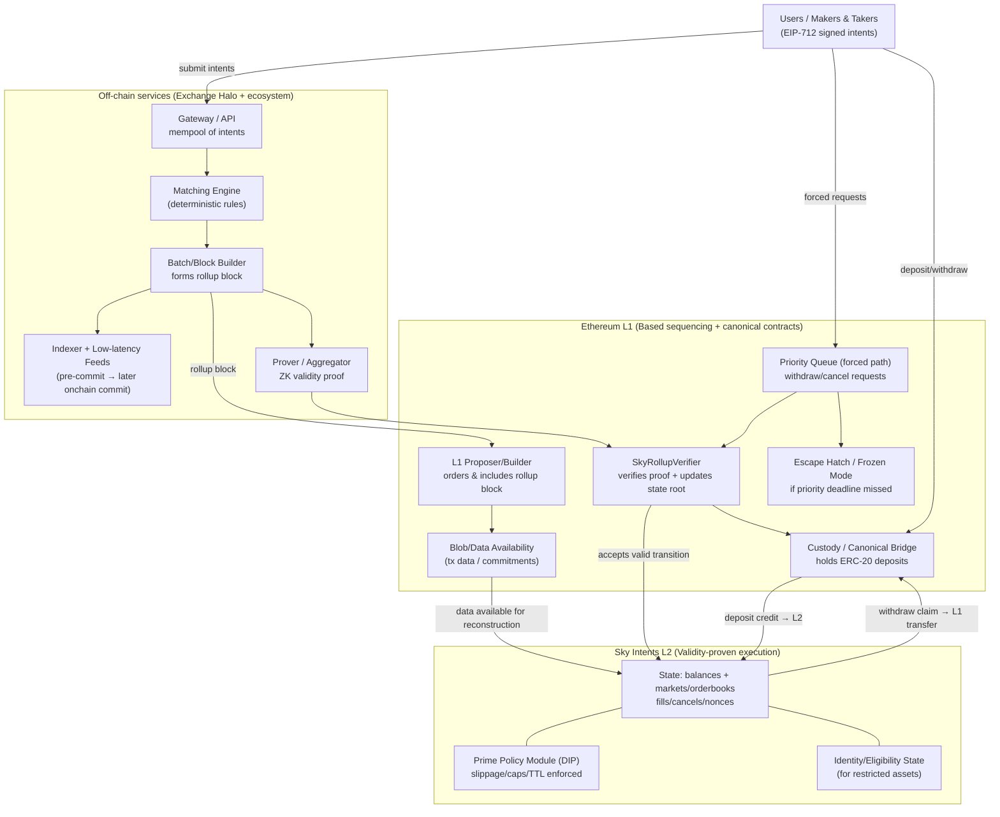

# Initial Architecture Design Direction

## Sky Intents as a Based Rollup

### Thesis

To make Sky Intents **trustless by default** while also achieving **fast execution** and tight alignment with **Ethereum liquidity and security**, we should design Sky Intents as an **Ethereum-anchored, application-specific rollup** whose state transitions *provably enforce* the Sky Intents execution rules.

Concretely: a **based (L1-sequenced) validity rollup** with Lighter-style separation of responsibilities:
- **L1 determines ordering / inclusion** (based sequencing)
- **L2 execution is validity-proven** (matching + settlement rules are enforced by the proof)
- **Ethereum is the custody + exit layer** (deposits/withdrawals + canonical state root)

This direction turns the “Exchange Halo is trusted to match fairly” assumption into:
> “Exchange Halo (or any proposer) may order/propose blocks, but cannot violate the matching + policy rules without producing an invalid proof.”

---

### Goals (default properties)

1) **Trustlessness by default**
- No reliance on a single operator’s honesty for matching fairness or settlement integrity.
- Users always retain enforceable exit rights via Ethereum.

2) **Fast execution**
- Sub-block UX via low-latency feeds + pre-commitments.
- Hard finality at the cadence of L1 block inclusion + proof verification.

3) **Seamless interoperability with Ethereum**
- Assets are custody-anchored to Ethereum (canonical bridge / verifier contract).
- All critical guarantees (validity, exits, governance controls) are enforceable on Ethereum.

---

### High-level architecture

#### L1 (Ethereum) contracts — “Sky Intents Rollup Contracts”
- **SkyRollupVerifier**
  - Stores the canonical state root.
  - Verifies validity proofs for state transitions (batches/blocks).
  - Processes L2->L1 messages (withdrawals, emergency actions).
- **Asset Custody / Canonical Bridge**
  - Holds escrowed ERC-20 assets backing L2 balances.
  - Handles deposits and withdrawal claims.
- **Priority Request Queue (forced path)**
  - Allows users to submit censorship-resistant requests on Ethereum:
    - withdrawals / exits
    - cancel-all (or cancel-by-nonce-range)
    - optional “reduce-only IOC” safety actions
  - Enforces inclusion deadlines; if missed, triggers an escape-hatch mode.
- **Escape Hatch / Frozen Mode**
  - If priority requests are not serviced by the deadline, the rollup freezes.
  - Users can exit using Ethereum-posted data and a proof of their balances.
- **Governance / Pause**
  - Global pause + per-market pause + per-asset pause hooks.
  - Timelocked upgrades (with clearly scoped emergency powers).

#### L2 execution layer — “Sky Intents Core (Rollup VM)”
- **State model**
  - Account balances (multi-asset)
  - Orderbooks (per market) + order priority metadata
  - Filled/cancelled nonce accounting
  - Prime sub-accounts / vault state (for DIP consumption windows)
  - Identity/eligibility registry state (for restricted assets)
- **Transaction types**
  - deposit credit (from L1)
  - withdraw request (to L1)
  - place order / cancel order(s)
  - match/settle (deterministic matching engine step)
  - oracle update ingestion (if needed as explicit tx type)
- **Deterministic matching**
  - Implement price-time priority as a rule of the state machine (not “best effort”).
  - Proof must attest that the matching step followed the rule.
  - This is the key to “trustless by default” rather than “audited operator.”

#### Off-chain services (operated by Exchange Halos, permissionlessly replaceable over time)
- **Gateway/API**
  - Receives signed orders/intents and submits them into the rollup pipeline.
- **Indexer + low-latency feeds**
  - Publishes orderbook and fill streams.
  - Uses pre-commitments so feeds are cryptographically bound to later L1 commitments.
- **Prover / aggregator**
  - Generates and aggregates proofs for state transitions.
- **Sentinel integrations**
  - Baseline/Stream/Warden provide monitoring, policy alerting, and emergency controls (aligned with the Sky safety model).

---

### Settlement cadence and batching policy (ties to your open questions)

In a rollup world, “settlement frequency” becomes: **how often we commit verified state transitions to Ethereum**.
Recommended default policy: **event-driven + max-latency cap**, with explicit bounds.

Define a **BatchingPolicy** struct in rollup config:
- Trigger A (time cap): commit at least once per L1 block (≈10–12s).
- Trigger B (size cap): commit early if tx count / match count exceeds N.
- Trigger C (risk/notional cap): commit early if total notional exceeds $X.

This mirrors the Dewiz recommendation while mapping cleanly to rollup mechanics.

---

### Fees / gas model

- Operator (Exchange Halo or block proposer) pays L1 costs (proof verification tx + blob posting).
- Recover via:
  - protocol trading fees (output-based accounting inside rollup state),
  - optional per-batch “settler” fee for permissionless proposers,
  - bounded fee schedules per market.

This keeps “fees are just outputs / state transitions” while making proposer economics explicit.

---

### Prime delegated trading (RTI + DIP) in a rollup architecture

### RTI (Risk Tolerance Interval)
**RTI** is the **off-chain** risk envelope in the Streaming Accord.  
Baseline enforces it by rejecting out-of-bounds stream intent before execution. It is the first-line behavioral guardrail.

### DIP (Delegated Intent Policy)
**DIP** is the **on-chain** fill-time policy on the Prime Intent Vault (PIV).  
It is the backstop to RTI and enforces constraints such as:
- allowed assets/pairs
- expiry/TTL bounds
- oracle-relative slippage limits
- per-intent and per-window notional caps via stateful consumption (for example `validateAndConsumeFill`)

`EIP-1271` should be described as vault-as-maker signature authorization that works alongside DIP enforcement.

To preserve the layered defense model:
- **RTI remains off-chain first-line filter (Baseline).**
- **DIP becomes an enforced rule inside the rollup state transition** for Prime-controlled sub-accounts:
  - enforce allowed pairs/assets
  - enforce expiry/TTL bounds
  - enforce per-window notional caps / exposure limits
  - enforce oracle-relative slippage bounds when required

Key design decision:
- Decide whether Prime “vaults” are:
  - (A) rollup-native accounts with policy modules, or
  - (B) rollup-native smart contracts (if we choose an EVM-based rollup VM).

Either way, the validity proof must cover policy enforcement so it remains an on-chain backstop.

---

### Oracle integration

Oracles should be treated as *state machine inputs* that must be:
- authenticated (signatures / verified source),
- bounded for staleness (maxAge),
- committed as public inputs so the proof binds execution to the oracle values used.

This is especially critical for delegated Prime constraints that require notional computation.

---

### Identity / restricted assets

Because token-level identity checks on L1 do not automatically apply to L2 internal balance moves:
- Either (A) restrict certain assets to L1-only settlement until identity is rollup-native, or
- (B) make identity membership a first-class condition in the rollup state machine for any transfer/trade involving restricted assets,
  and mirror/anchor identity roots to Ethereum (Identity Network registry).

---

### Emergency controls

Define pause precedence consistently:
global > halo > market > asset

In rollup terms:
- “pause” means halting acceptance/finalization of new state transitions,
- while preserving forced exits via the priority queue / escape hatch.
