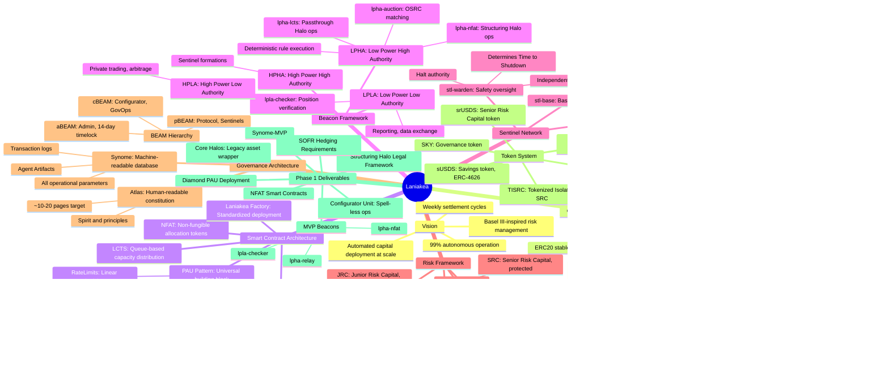

# Laniakea Programme Overview

**Created:** 2026-02-01
**Purpose:** Summary of Laniakea scope, organisational structure, and skills requirements

---

## Part 1: Laniakea Summary Mind Map



---

## Part 2: Phase 1 Delivery Organisation

Phase 1 focuses on pragmatic delivery of minimal viable infrastructure for automated capital deployment, operating on a monthly settlement cycle.

### Phase 1 Organisational Structure


### Phase 1 Skills Matrix

| Role | Core Skills Required | Secondary Skills |
|------|---------------------|------------------|
| **Programme Director** | Programme management, stakeholder management, DeFi/TradFi domain knowledge | Risk management, governance |
| **Technical Architect** | Solidity, EVM architecture, system design, distributed systems | Security, formal verification |
| **Product Owner** | Product management, requirements gathering, DeFi protocols | Risk frameworks, tokenomics |
| **SC Lead** | Solidity expert, EIP-2535 (Diamond), ERC-4626, ERC-721 | Gas optimization, upgradability patterns |
| **Diamond PAU Engineer** | Solidity, Diamond proxy pattern, access control | Testing frameworks (Foundry) |
| **NFAT Engineer** | Solidity, ERC-721, queue mechanics | ERC-4626 vault patterns |
| **Configurator Engineer** | Solidity, timelocks, rate limiting | BEAM hierarchy, governance integration |
| **Beacon Lead** | Python/Go, event-driven architecture, blockchain integration | AI/ML foundations |
| **lpla-checker Developer** | Python/Go, risk calculations, data pipelines | Oracle integration |
| **lpha-relay Developer** | Python/Go, transaction management, rate limiting | MEV protection |
| **lpha-nfat Developer** | Python/Go, NFAT lifecycle, queue management | Smart contract interaction |
| **Infra Lead** | Database design, API architecture, cloud infrastructure | Graph databases, on-chain indexing |
| **Synome-MVP Engineer** | Database engineering, data modelling, signed statements | Cryptographic signatures |
| **DevOps Engineer** | Kubernetes, monitoring, CI/CD, blockchain nodes | Security, disaster recovery |
| **Risk Framework Lead** | Quantitative risk, Basel III/FRTB, capital requirements | DeFi risk, credit risk |
| **Risk Analyst** | Financial modelling, stress testing, scenario analysis | Duration analysis, correlation |
| **Operations Lead** | Operational processes, settlement cycles, incident response | Governance, compliance |
| **GovOps Specialist** | Governance operations, BEAM management, spell execution | Multisig coordination |
| **Legal Lead** | Structured finance, securities law, DeFi legal | Bankruptcy remoteness, SPV structures |
| **Structuring Lawyer** | Deal structuring, buybox design, counterparty agreements | Cross-jurisdiction compliance |
| **Buybox Specialist** | Parameter design, recourse mechanisms, legal templates | Regulatory frameworks |
| **QA Lead** | Test strategy, security testing, audit coordination | Smart contract testing |
| **SC Auditor** | Security auditing, formal verification, vulnerability analysis | Solidity, attack vectors |
| **Integration Tester** | End-to-end testing, beacon testing, settlement validation | Automation frameworks |

### Phase 1 Team Size Summary

| Function | Headcount |
|----------|-----------|
| Leadership | 3 |
| Smart Contracts | 4 |
| Beacon Development | 4 |
| Infrastructure | 3 |
| Risk & Operations | 4 |
| Legal & Compliance | 3 |
| Quality Assurance | 3 |
| **Total** | **24** |

---

## Part 3: Full Programme Organisation

The full programme includes Phase 1 plus subsequent phases with weekly settlement, AI-powered sentinels, multi-chain expansion, and full automation.

### Full Programme Organisational Structure


### Full Programme Skills Matrix

#### Executive Leadership

| Role | Core Skills | Domain Expertise |
|------|-------------|------------------|
| Chief Executive | Strategic leadership, capital markets, regulatory relationships | DeFi, TradFi, governance |
| Chief Technology Officer | System architecture, engineering leadership, technology strategy | Blockchain, distributed systems, AI |
| Chief Risk Officer | Enterprise risk management, regulatory frameworks, quantitative methods | Basel III, FRTB, DeFi risk |
| Chief Legal Officer | Securities law, structured finance, regulatory compliance | Cross-jurisdiction, DAO governance |

#### Engineering Division

| Team | Core Skills | Specialist Skills |
|------|-------------|-------------------|
| **PAU Team** | Solidity, Diamond proxy, ERC-4626 | Upgradability, gas optimization, formal verification |
| **Token Standards Team** | Solidity, ERC-721, LCTS queue mechanics | Tokenomics, capacity distribution |
| **Factory Team** | Solidity, factory patterns, deployment automation | CREATE2, deterministic addresses |
| **Sentinel Team** | Python/Go, real-time systems, ML inference | Trading systems, execution algorithms |
| **Beacon Team** | Python/Go, event-driven architecture | Rate limiting, transaction management |
| **ML/AI Team** | Machine learning, reinforcement learning, NLP | On-chain data, market signals |
| **Synome Team** | Graph databases, data modelling, cryptographic proofs | Distributed state, consensus |
| **Observability Team** | Monitoring, alerting, distributed tracing | Prometheus, Grafana, on-chain indexing |
| **Infrastructure Team** | Kubernetes, cloud architecture, blockchain nodes | High availability, disaster recovery |
| **Bridge Team** | Cross-chain messaging, LayerZero, CCTP | Canonical bridging, security |
| **Foreign Deploy Team** | Multi-chain Solidity, chain-specific quirks | L2s, alt-L1s (Solana, etc.) |
| **Chain Integration Team** | Protocol integration, oracle networks | Price feeds, liquidity protocols |

#### Risk Division

| Team | Core Skills | Specialist Skills |
|------|-------------|-------------------|
| **Capital Requirements Team** | Quantitative modelling, capital formulas | Duration matching, encumbrance |
| **Market Risk Team** | FRTB, VaR, stress testing | Crypto volatility, drawdown modelling |
| **Credit Risk Team** | Credit analysis, default modelling | Jump-to-default, gap risk |
| **Operational Risk Team** | Operational controls, process risk | Sentinel risk, TTS analysis |

#### Operations Division

| Team | Core Skills | Specialist Skills |
|------|-------------|-------------------|
| **GovOps Team** | Governance operations, BEAM management | Spells, timelocks, multisig |
| **Settlement Team** | Settlement processes, reconciliation | Weekly cycle, auction settlement |
| **Incident Response Team** | Incident management, emergency procedures | On-chain triage, warden coordination |
| **Prime Operations Team** | Prime coordination, artifact management | Halo onboarding, Unit deployment |

#### Legal & Compliance Division

| Team | Core Skills | Specialist Skills |
|------|-------------|-------------------|
| **Structuring Team** | Deal structuring, buybox design | NFAT terms, bankruptcy remoteness |
| **Regulatory Team** | Securities regulation, compliance | Multi-jurisdiction, MiCA, US law |
| **Governance Legal Team** | DAO governance, constitutional design | Atlas/Synome, escalation procedures |

#### Security Division

| Team | Core Skills | Specialist Skills |
|------|-------------|-------------------|
| **Smart Contract Security** | Security auditing, formal verification | Attack vectors, invariant testing |
| **Infrastructure Security** | Key management, access control | HSMs, multisig, operational security |
| **Audit Coordination** | External audit management, remediation | Bug bounties, responsible disclosure |

#### Product Division

| Team | Core Skills | Specialist Skills |
|------|-------------|-------------------|
| **Prime Products** | Product management, Prime requirements | Capital deployment, risk capital |
| **Halo Products** | Product management, Halo requirements | Passthrough, Structuring, LCTS/NFAT |
| **User Experience** | UX design, developer experience | SDK, documentation, integrations |

### Full Programme Team Size Summary

| Division | Teams | Approximate Headcount |
|----------|-------|----------------------|
| Executive Leadership | 4 | 4 |
| Programme Management | 4 | 6 |
| Engineering - Core SC | 3 teams | 12 |
| Engineering - Automation | 3 teams | 15 |
| Engineering - Platform | 3 teams | 12 |
| Engineering - Multi-Chain | 3 teams | 10 |
| Risk | 4 teams | 12 |
| Operations | 4 teams | 14 |
| Legal & Compliance | 3 teams | 8 |
| Security | 3 teams | 8 |
| Product | 3 teams | 9 |
| **Total** | | **~110** |

---

## Part 4: Skills Gap Analysis - Phase 1 to Full Programme

### New Capabilities Required for Full Programme

| Capability | Phase 1 | Full Programme | Skills Delta |
|------------|---------|----------------|--------------|
| **AI/ML for Sentinels** | Not required | Critical | ML engineers, RL specialists, trading system experts |
| **Multi-Chain** | Not required | Required | Bridge engineers, alt-chain specialists |
| **Weekly Settlement** | Monthly only | Weekly automation | Higher ops velocity, auction systems |
| **HPHA Sentinels** | LPHA beacons only | Full sentinel formations | Streaming Accord, warden network |
| **Scale** | First cohort | Full ecosystem | Enterprise architecture, platform thinking |

### Critical Hiring Priorities for Expansion

1. **ML/AI Team** - For HPHA sentinel development (stl-stream intelligence)
2. **Bridge Team** - For Foreign layer deployment
3. **Settlement Team** - For weekly cycle automation
4. **Sentinel Team** - For stl-base/stl-warden implementation
5. **Observability Team** - For production monitoring at scale

---

## Part 5: Governance & Reporting Structure

### Phase 1 Governance

```
Sky Core Governance
       │
       ├── Core Council (aBEAM holders)
       │       │
       │       └── GovOps Teams (cBEAM holders)
       │               │
       │               └── Operational Beacons (pBEAM holders)
       │
       └── Fortification Conserver
               │
               └── Emergency Response
```

### Full Programme Governance

```
Sky Core Governance
       │
       ├── Core Council
       │       │
       │       ├── Generator GovOps
       │       ├── Prime GovOps (per Prime)
       │       │       └── Sentinel Formations
       │       │               ├── stl-base
       │       │               ├── stl-stream (Ecosystem Actors)
       │       │               └── stl-warden (Independent Operators)
       │       └── Halo GovOps (per Halo Class)
       │               └── LPHA Beacons
       │                       ├── lpha-lcts
       │                       └── lpha-nfat
       │
       ├── Fortification Conserver
       │       └── Legal recourse, asset recovery
       │
       └── Alignment Conservers
               └── Governance integrity
```

---

*Document generated from Laniakea documentation repository analysis.*
